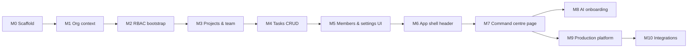

# TCM Command Centre — Implementation Guide

**Document purpose:** Step-by-step build order for the Command Centre — core modules first, extended features after.  
**Companion spec:** [`TCM-Command-Centre-Technical-Spec.md`](./TCM-Command-Centre-Technical-Spec.md) (Draft v5)  
**Status:** Implementation plan — 2026-05-31  
**Stack:** Laravel 11+, Fortify, Inertia.js + React 19, Wayfinder, Tailwind v4, shadcn/ui

---

## Table of Contents

1. [How to use this guide](#1-how-to-use-this-guide)
2. [Prerequisites & conventions](#2-prerequisites--conventions)
3. [Roadmap overview](#3-roadmap-overview)
4. [Part A — Core platform (Milestones 0–6)](#part-a--core-platform-milestones-06)
5. [Part B — Command centre parity (Milestone 7)](#part-b--command-centre-parity-milestone-7)
6. [Part C — AI onboarding & assist (Milestone 8)](#part-c--ai-onboarding--assist-milestone-8)
7. [Part D — Production platform (Milestone 9)](#part-d--production-platform-milestone-9)
8. [Part E — Integrations & polish (Milestone 10)](#part-e--integrations--polish-milestone-10)
9. [Testing strategy](#9-testing-strategy)
10. [Master checklist](#10-master-checklist)
11. [Spec cross-reference index](#11-spec-cross-reference-index)

---

## 1. How to use this guide

| Rule | Detail |
|------|--------|
| **Order matters** | Complete milestones in sequence unless a step explicitly says “parallel”. Later milestones assume earlier deliverables exist. |
| **Spec is source of truth** | Field names, permission slugs, route names, and business rules live in the technical spec. This guide tells you **when** and **in what order** to build them. |
| **Mirror existing patterns** | Copy SiteGuard / LR-POS patterns: `SelectedSiteManager` → `SelectedOrganizationManager`, `site-selector.tsx` → `organization-selector.tsx`, Form Requests, Wayfinder forms, feature tests. |
| **One vertical slice at a time** | Prefer: migration → model → policy → controller → request → route → page → test — per feature, not “all migrations then all controllers”. |
| **Checkboxes** | Use `- [ ]` items as PR / sprint tasks. Mark complete only when acceptance criteria pass. |

**Definition of done (every milestone):**

- Migrations run cleanly (`php artisan migrate`)
- Named routes registered; Wayfinder regenerated (`npm run build`)
- Feature tests cover happy path + permission denial
- No tenant query without `organization_id` scope
- Inertia pages type props per spec §16

---

## 2. Prerequisites & conventions

### 2.1 Before Milestone 0

- [ ] Read spec §1–§6 (domain, schema overview, architecture)
- [ ] Read spec §4.1 (UI shell — sidebar + content header)
- [ ] Confirm Fortify auth works locally
- [ ] Confirm queue worker available for later mail/notifications (`php artisan queue:work`)

### 2.2 File & route conventions

| Area | Convention |
|------|------------|
| Routes | New file `routes/command_centre.php`; `require` from `routes/web.php` |
| Controllers | `app/Http/Controllers/CommandCentre/` for tenant dashboard; top-level for org CRUD |
| Requests | `app/Http/Requests/CommandCentre/` or `Organizations/` |
| Support | `app/Support/` — stateless helpers (mirror `SelectedSiteManager`, `PermissionRegistry`) |
| Policies | `app/Policies/` — one policy per model |
| Frontend pages | `resources/js/pages/organizations/…`, `resources/js/pages/command-centre/…` |
| Types | Extend `resources/js/types/`; re-export from `index.ts` |
| Shared props | `HandleInertiaRequests::share()` — add `organizationContext` (keep `siteContext` for SiteGuard until split) |

### 2.3 Patterns to copy from codebase

| Command Centre | Copy from |
|----------------|-----------|
| `SelectedOrganizationManager` | `app/Support/SelectedSiteManager.php` |
| `OrganizationContextController` | `app/Http/Controllers/SiteContextController.php` |
| `EnsureOrganizationAccess` | `app/Http/Middleware/EnsureSiteAccess.php` |
| `use-organization-context.ts` | `resources/js/hooks/use-site-context.ts` |
| `organization-selector.tsx` | `resources/js/components/site-selector.tsx` |
| AI agents | `app/Ai/` (SiteGuard assistant pattern) |
| Permission registry UI | Settings roles pages + `PermissionRegistry` |

---

## 3. Roadmap overview



| Milestone | Name | Spec §19 phase | Tables | Outcome |
|-----------|------|----------------|--------|---------|
| **0** | Scaffold | — | — | Route file, namespaces, enums, empty registries |
| **1** | Organization context & home | Phase 1 (partial) | `organizations`, `organization_members` | Post-login org home, org switcher session |
| **2** | RBAC bootstrap | Phase 1 | + roles, role_permissions | Org create materializes roles; permission middleware |
| **3** | Projects & project team | Phase 1 | + projects, project_roles, project_members, pivots | Manual project create with bootstrap |
| **4** | Unified tasks | Phase 1 | + `tasks`, `task_assignees` | Full task CRUD with assignees & scopes |
| **5** | Members & org settings UI | Phase 1 | — | Roster, org profile, org role matrix |
| **6** | App shell (header layout) | Phase 1 | — | Org selector + NavUser in header row |
| **7** | Command centre parity | Phase 2 | + focus, notes | Dashboard, focus pins, reminders, demo seeder |
| **8** | AI onboarding & assist | Phase 2b | + 4 AI tables | Wizard, proposals, apply flow |
| **9** | Production platform | Phase 3 | + 12 platform tables | Invites, mail, notifications, audit, comments, exports |
| **10** | Integrations & polish | Phase 4 | integrations, webhooks | Drive OAuth, webhooks, reports |

---

# Part A — Core platform (Milestones 0–6)

> **Goal:** Authenticated multi-tenant foundation — org home, RBAC, projects, tasks, settings, and app shell — without AI or production mail/notifications yet.

---

## Milestone 0 — Scaffold

**Depends on:** nothing  
**Spec refs:** §6, §9, §11.3, §20, §13.1

### 0.1 Backend scaffold

- [ ] Create `routes/command_centre.php`; register in `bootstrap/app.php` or `routes/web.php`
- [ ] Register middleware aliases in `bootstrap/app.php`:
  - `org.access` → `EnsureOrganizationAccess`
  - `org.member` → `EnsureOrganizationMember`
  - `org.permission` → `EnsureOrganizationPermission`
  - `project.access` → `EnsureProjectAccess`
  - `project.permission` → `EnsureProjectPermission`
- [ ] Create empty/stub classes:
  - `app/Support/CommandCentrePermissionRegistry.php` (§11.3 catalog)
  - `app/Support/CommandCentreRoleTemplateRegistry.php` (§10.15)
  - `app/Support/SelectedOrganizationManager.php` (§6.2)
  - `app/Support/EffectivePermissionService.php` (§6.3)
  - `app/Support/TaskVisibilityScope.php`, `ProjectVisibilityScope.php` (§12)
- [ ] Create PHP enums per spec §9:
  - `TaskKind`, `TaskStatus`, `PriorityLevel`, `DeadlineType`, `ProjectHealth`
  - `OrganizationMemberStatus`, `MailProvider` (stub for later)
- [ ] Add `OrganizationMemberResolver` helper (resolve current member for selected org)

### 0.2 Frontend scaffold

- [ ] Add `resources/js/types/organization.ts` (§16 shapes — stub)
- [ ] Add `resources/js/hooks/use-organization-context.ts` (mirror site hook)
- [ ] Extend `resources/js/types/global.d.ts` with `organizationContext` shared prop
- [ ] Plan `resources/js/hooks/use-org-permissions.ts` (mirror `use-permissions` for org slugs)

### Acceptance

- [ ] `php artisan route:list --name=organizations` shows no errors (even if routes 404)
- [ ] App boots; SiteGuard unchanged

---

## Milestone 1 — Organization context & home

**Depends on:** M0  
**Spec refs:** §5.0, §6.2, §8.2, §8.3, §13.1, §14 (`StoreOrganizationRequest`, `UpdateOrganizationContextRequest`)

### 1.1 Migrations

- [ ] `create_organizations_table` (§8.2)
- [ ] `create_organization_members_table` (§8.3) — include `is_primary_org`, indexes

### 1.2 Models & relationships

- [ ] `Organization`, `OrganizationMember` models
- [ ] `User`: `organizationMemberships()`, `ownedOrganizations()`, `accessibleOrganizations()`

### 1.3 SelectedOrganizationManager

Implement full §6.2 behaviour:

- [ ] `accessibleOrganizationsQuery()` — active + invited unions
- [ ] `activeMembershipsQuery()` — active only
- [ ] `resolveSelectedOrganization()` — session → primary → first → null
- [ ] `requireSelectedOrganization()` — redirect to `organizations.index` if none
- [ ] `sharedContext()` — `{ selectedOrganization, organizations, pendingInvitations }` (invitations stub empty until M9)

### 1.4 Middleware

- [ ] `EnsureOrganizationAccess` — route model bind `{organization}`; user can see org in accessible query
- [ ] `EnsureOrganizationMember` — active membership required for tenant routes

### 1.5 Controllers & routes

- [ ] `OrganizationController@index` → `GET /organizations` (org home — **new post-login landing**)
- [ ] `OrganizationController@create`, `@store` — stub store without bootstrap until M2
- [ ] `OrganizationContextController@update` → `POST /organizations/select`
- [ ] Form requests: `StoreOrganizationRequest`, `UpdateOrganizationContextRequest`

### 1.6 Inertia

- [ ] Share `organizationContext` in `HandleInertiaRequests` (lazy closure like `siteContext`)
- [ ] Page `resources/js/pages/organizations/index.tsx` — list orgs (created / member / invited badges), Create CTA, empty state
- [ ] Page `resources/js/pages/organizations/create.tsx` — name, timezone, focus_cap (minimal wizard)
- [ ] Update post-login redirect: authenticated home → `organizations.index` (or configurable; document in `.env` if needed)

### 1.7 Tests

- [ ] Guest cannot access org home
- [ ] New user sees empty state + create CTA
- [ ] Org select updates session and redirects

### Acceptance

- [ ] User can register, land on org home, see empty state
- [ ] Org switcher API (`organizations.select`) works once orgs exist

---

## Milestone 2 — RBAC bootstrap

**Depends on:** M1  
**Spec refs:** §5.2, §5.3, §10.5, §11, §8.4–§8.5

### 2.1 Migrations

- [ ] `create_organization_roles_table` (§8.4)
- [ ] `create_organization_role_permissions_table` (§8.5)

### 2.2 Registries & bootstrap

- [ ] Implement `CommandCentrePermissionRegistry::orgGroups()` — full org catalog (§11.3)
- [ ] Implement `CommandCentreRoleTemplateRegistry::orgRoles()` — owner, admin, lead, member, viewer (§11.9 exact slugs)
- [ ] Implement `OrganizationBootstrapService` (§10.5):
  - Transaction: org row → 5 roles → permission rows → creator member as `owner` → set `is_primary_org` on first org
  - Optional: default catch-all project (defer to M3 if simpler)
- [ ] Wire `OrganizationController@store` → bootstrap → set selected org → redirect command centre (route stub OK)

### 2.3 EffectivePermissionService

- [ ] Load org role permissions for current member (request-scoped cache)
- [ ] `canOrg(string $slug): bool`
- [ ] Share effective org permissions in Inertia on tenant pages (§11.11)

### 2.4 Middleware & policies

- [ ] `EnsureOrganizationPermission` — slug param; 403 if missing
- [ ] `OrganizationPolicy` — show/update/destroy checks

### 2.5 Org role management (backend)

- [ ] `OrganizationRoleController` — index, store, update, destroy, `syncPermissions`
- [ ] Routes per §11.4 (org roles group)
- [ ] `UpdateOrganizationRolePermissionsRequest` (§14)

### 2.6 Tests

- [ ] Org create materializes 5 roles with expected permission counts
- [ ] Owner has all org slugs; viewer denied `org.tasks.store`
- [ ] `syncPermissions` rejects unknown slugs

### Acceptance

- [ ] Create org from wizard → roles exist → creator is owner member
- [ ] Permission middleware blocks unauthorized routes

---

## Milestone 3 — Projects & project team

**Depends on:** M2  
**Spec refs:** §8.6–§8.9, §10.4, §11.5, §5.4

### 3.1 Migrations

- [ ] `create_projects_table` (§8.6)
- [ ] `create_project_roles_table` (§8.7)
- [ ] `create_project_role_permissions_table` (§8.8)
- [ ] `create_project_members_table` (§8.9)

### 3.2 Bootstrap

- [ ] `CommandCentrePermissionRegistry::projectGroups()` (§11.3 project catalog)
- [ ] `CommandCentreRoleTemplateRegistry::projectRoles()` (§11.9)
- [ ] `ProjectBootstrapService` (§10.4) — 4 roles + permissions + creator as `project_owner`
- [ ] Extend `EffectivePermissionService` — merge project permissions when `project_id` in context

### 3.3 Controllers & routes

- [ ] `ProjectController` — index, store, show, update, archive (§11.4)
- [ ] `ProjectMemberController` — index, store, update, destroy (§11.5)
- [ ] `ProjectRoleController` — index, syncPermissions (§11.5)
- [ ] Middleware: `EnsureProjectAccess`, `EnsureProjectPermission`
- [ ] `ProjectVisibilityScope` (§12.2)

### 3.4 Form requests

- [ ] `StoreProjectRequest`, `UpdateProjectRequest`
- [ ] `StoreProjectMemberRequest` (§14)

### 3.5 Frontend (minimal)

- [ ] `organizations/{org}/projects/index.tsx` — list with health dots
- [ ] `organizations/{org}/projects/show.tsx` — project detail shell
- [ ] `projects/{project}/settings/team.tsx` — team roster
- [ ] `projects/{project}/settings/roles.tsx` — project permission matrix

### 3.6 Tests

- [ ] Project create runs bootstrap; creator on team as project_owner
- [ ] Member with `scope.member` sees only joined projects
- [ ] Non-member cannot access project routes

### Acceptance

- [ ] Manual project create works end-to-end with team assignment

---

## Milestone 4 — Unified tasks

**Depends on:** M3  
**Spec refs:** §8.10–§8.11, §12.1, §11.4 tasks group, §14 `StoreTaskRequest`

### 4.1 Migrations

- [ ] `create_tasks_table` (§8.10) — `kind`, deadlines, `meta`, indexes
- [ ] `create_task_assignees_table` (§8.11)

### 4.2 Domain

- [ ] `Task` model — scopes: `forOrganization`, `ofKind`, relationships
- [ ] `TaskPolicy` — route + scope checks (§11.10)
- [ ] `TaskVisibilityScope` (§12.1)
- [ ] Validation rules: `ProjectTaskAssigneesMustBeOnTeam`, `StoreTaskRequiresProjectAccess`

### 4.3 Controllers

- [ ] `CommandCentre/TaskController` — index, store, show, update, destroy
- [ ] `updateStatus`, `syncAssignees`, `toggleDone` (§11.4)
- [ ] Optional thin `ReminderController` delegating to `Task` with `kind=reminder` (or single controller + kind filter)

### 4.4 Frontend

- [ ] Task list components (table with filters: project, assignee, kind)
- [ ] Task create/edit modal or drawer
- [ ] Multi-select assignee picker from org members on project team
- [ ] `use-org-permissions` gates buttons (`org.tasks.store`, etc.)

### 4.5 Tests

- [ ] Task requires `project_id`
- [ ] Multiple assignees sync correctly
- [ ] `scope.own` member sees only assigned tasks
- [ ] `scope.all` sees all visible-project tasks

### Acceptance

- [ ] CRUD tasks with assignees under a project
- [ ] Permission + scope enforced on index and mutations

---

## Milestone 5 — Members & org settings UI

**Depends on:** M2 (can parallel with M3/M4 after M2)  
**Spec refs:** §8.3, §11.4 members group, §15 settings pages

### 5.1 Backend

- [ ] `OrganizationMemberController` — index, store, show, update, disable
- [ ] `OrganizationController@show`, `@update` — org profile + settings JSON
- [ ] Store/update requests for members and org profile

### 5.2 Frontend — settings area

Extend app layout switch in `app.tsx` if needed; pages under `organizations/{org}/settings/`:

- [ ] `settings/index.tsx` — org profile (name, logo, timezone, focus_cap, ai_enabled flag)
- [ ] `settings/members.tsx` — roster table (display_name, role, title, status)
- [ ] `settings/roles/index.tsx` + `settings/roles/show.tsx` — role list + permission matrix UI (mirror platform roles UI)

### 5.3 Sidebar nav

- [ ] Update `AppSidebar` / `NavMain` with Command Centre sections gated by org permissions:
  - Command Centre
  - Projects
  - Tasks
  - Settings (org)

### 5.4 Tests

- [ ] Admin can add roster member (user_id optional)
- [ ] Disable member blocks tenant access
- [ ] Role matrix saves valid slugs only

### Acceptance

- [ ] Org admin can manage roster and org roles from UI

---

## Milestone 6 — App shell (header layout)

**Depends on:** M1 (org context)  
**Spec refs:** §4.1, §15.1

### 6.1 Components

- [ ] `organization-selector.tsx` — mirror `site-selector.tsx`; POST `organizations.select`
- [ ] Update `app-sidebar-header.tsx`:
  - Left cluster: `SidebarTrigger` → `OrganizationSelector` → `Breadcrumbs`
  - Right: `NavUser`
- [ ] Update `app-sidebar.tsx` — **remove** `NavUser` from `SidebarFooter`
- [ ] Optional: `NavUser` prop `layout="header"` for compact header styling (§4.1)

### 6.2 Layout resolver

- [ ] Ensure Command Centre pages use `AppSidebarLayout` (existing pattern)
- [ ] Org home (`organizations/index`) may use simpler layout without tenant sidebar — document choice (full shell vs minimal)

### 6.3 Tests

- [ ] Feature: header renders org selector when user has orgs
- [ ] Browser/manual: collapse sidebar + switch org in same row

### Acceptance

- [ ] Matches §4.1 diagram: toggle and org switcher same row; profile menu top-right of content header

---

# Part B — Command centre parity (Milestone 7)

> **Goal:** Prototype dashboard UX — KPIs, focus pins, reminders, notes, demo data.

**Depends on:** M4, M5, M6  
**Spec refs:** §4.2, §10.1–§10.3, §10.7, §12.3, §17, Phase 2

---

## Milestone 7 — Command centre page

### 7.1 Migrations

- [ ] `create_member_daily_focus_table` (§8.12)
- [ ] `create_member_notes_table` (§8.13)

### 7.2 Services

- [ ] `SyncMemberDailyFocus` (§10.1) — auto pins from tasks when enabled
- [ ] Focus complete → task complete (§10.2)
- [ ] Follow-up → reminder task (§10.3)
- [ ] `CommandCentreStats` (§10.7)

### 7.3 Controllers

- [ ] `CommandCentreController@index` — aggregate props (§16 `CommandCentrePageProps`)
- [ ] `MemberDailyFocusController` — index, store, reorder, destroy
- [ ] `MemberNoteController` — CRUD
- [ ] Reminder routes (if not folded into TaskController)

### 7.4 Frontend — command centre page

Page: `resources/js/pages/command-centre/index.tsx` (or `organizations/{org}/command-centre.tsx`)

| Prototype module | Component | Spec §4.2 |
|------------------|-----------|-----------|
| Greeting + KPIs | `CommandCentreHeader`, stat cards | #1 |
| Assigned to me | `AssignedTasksPanel` | #2 |
| Today's Priorities | `FocusPinList` (max 10) | #3 |
| Full task list | `TaskTable` with filters | #4 |
| Strategic projects | `ProjectGrid` | #5 |
| Reminders | `ReminderList` | #6 |
| CEO notes | `MemberNotesPanel` | #7 |

- [ ] Query params: `focus_date`, `project_id`, `assignee_member_id` (§13.2)
- [ ] Bottom status bar (open / done today / projects / saved)
- [ ] Responsive breakpoints 1100px / 720px (§18)

### 7.5 Demo seeder

- [ ] `TcmCommandCentreDemoSeeder` (§17) — import from `TCM Group Dashboard.html` data
- [ ] Register in `DatabaseSeeder` behind env flag

### 7.6 Tests

- [ ] Command centre loads for member with `org.command-centre.index`
- [ ] Focus cap enforced (10 max)
- [ ] Notes scoped to current member only
- [ ] Stats counts match scoped tasks

### Acceptance

- [ ] Demo seeder + command centre page matches prototype sections
- [ ] Focus pin reorder and complete syncs task status

---

# Part C — AI onboarding & assist (Milestone 8)

> **Goal:** Human-in-the-loop AI project setup and in-project assist.

**Depends on:** M7 (or minimally M3+M4)  
**Spec refs:** §22, §10.6, §10.14, Phase 2b

---

## Milestone 8 — AI module

### 8.1 Migrations

- [ ] `ai_sessions`, `ai_messages`, `ai_onboarding_proposals`, `ai_audit_logs` (§8.26–§8.29)

### 8.2 Agents & tools

- [ ] `ProjectOnboardingAssistant` + tools (§20 `app/Ai/`)
- [ ] `ProjectAssistAgent` + `ProposeTaskBatchTool`
- [ ] Optional: `OrgOnboardingAssistant` for org wizard copy
- [ ] All tool calls → `ai_audit_logs`

### 8.3 Services

- [ ] `ApplyOnboardingProposal` (§10.6) — atomic: project bootstrap + tasks + assignees + decisions + reminders
- [ ] Proposal versioning / supersede (§10.14)

### 8.4 Controllers & routes

- [ ] `AiSessionController`, `AiOnboardingController`, `ProjectOnboardingController`
- [ ] Full AI route group §11.4 (ai-sessions, ai-onboarding, ai-assist)
- [ ] Rate limiting per org; respect `organizations.settings.ai_enabled`

### 8.5 Frontend

- [ ] `organizations/{org}/projects/onboarding.tsx` — steps: Brief → Team → Generate → Review
- [ ] `organizations/{org}/projects/onboarding/review/{proposal}.tsx` — editable payload
- [ ] `organizations/{org}/projects/{project}/assist.tsx` — drawer chat
- [ ] Types: `AiOnboardingProposal`, `ProjectOnboardingPageProps` (§16)

### 8.6 Tests

- [ ] Propose creates `pending_review` proposal without mutating tasks
- [ ] Apply creates project + tasks in one transaction
- [ ] Reject / supersede flows
- [ ] AI disabled org returns 403

### Acceptance

- [ ] End-to-end onboarding: chat → proposal → approve → apply → land on project

---

# Part D — Production platform (Milestone 9)

> **Goal:** Invitations, mail, notifications, audit, collaboration, exports.

**Depends on:** M5 (members), M4 (tasks)  
**Spec refs:** §8.14–§8.25, §10.8–§10.13, §21, Phase 3

Build in this **sub-order** (dependencies inside M9):

### 9.1 Activity logging (foundation for audit UI)

- [ ] Migration `activity_logs` (§8.20)
- [ ] `ActivityLogger` + listeners on task/project/member mutations (§10.11)
- [ ] `ActivityLogController@index` + settings page

### 9.2 Task comments & attachments

- [ ] Migrations `task_comments`, `attachments` (§8.21–§8.22)
- [ ] Controllers + policies; file storage local/S3 (§18)
- [ ] Side effects §10.13 — notify assignees on comment
- [ ] Task detail drawer UI

### 9.3 Invitations

- [ ] Migration `organization_invitations` (§8.14)
- [ ] `OrganizationInvitationController` + public `InvitationAcceptController` (§10.12)
- [ ] Accept flow links member, updates home list
- [ ] *Defer outbound invite email until 9.4* — UI can create pending invites

### 9.4 Mail profiles

- [ ] Migration `organization_mail_profiles` (§8.15) — encrypt secrets
- [ ] `OrganizationMailProfileController` + `GmailOAuthController`
- [ ] `OrganizationMailerResolver`, `SendOrganizationMail` job (§10.8)
- [ ] Settings page `/settings/mail` + test send (§21.2)

### 9.5 Notifications

- [ ] Migrations: `notifications`, `notification_deliveries`, `scheduled_notifications`, `member_notification_preferences` (§8.16–§8.19)
- [ ] `NotificationDispatcher` pipeline (§10.8)
- [ ] `ScheduleTaskDeadlineReminders` listener + cron command (§10.9)
- [ ] In-app bell UI + `NotificationController`
- [ ] Preferences UI `/settings/my-notifications`
- [ ] Laravel notification classes (§20 `app/Notifications/`)

### 9.6 Invitations email (connect 9.3 + 9.4)

- [ ] `MemberInvitedMail` queued via org mail profile
- [ ] Resend invitation action

### 9.7 Exports

- [ ] Migration `export_jobs` (§8.25)
- [ ] `ExportController` + `ProcessExportJob` — tasks CSV
- [ ] Export button on task list

### 9.8 Tests (M9)

- [ ] Invitation accept creates active member
- [ ] Mail test send logs delivery row
- [ ] Notification respects member preferences
- [ ] Scheduled reminder idempotent via `dedupe_key`
- [ ] Attachment upload + delete policy

### Acceptance

- [ ] Invite user by email → accept → access org
- [ ] Task assignment sends in-app + email (if enabled)
- [ ] Activity log records task updates

---

# Part E — Integrations & polish (Milestone 10)

> **Goal:** External integrations, webhooks, reporting, ops polish.

**Depends on:** M9  
**Spec refs:** §8.23–§8.24, Phase 4

### 10.1 Integrations

- [ ] Migration `organization_integrations` — Google Drive OAuth tokens (encrypted)
- [ ] Settings UI `/settings/integrations`
- [ ] Attach Drive link picker on tasks (URL field exists from M4; OAuth enhances)

### 10.2 Webhooks

- [ ] Migration `webhook_endpoints`
- [ ] CRUD + `DeliverWebhookJob` on task/project events
- [ ] Permission slugs `org.webhooks.*`, `org.integrations.*` (already in registry)

### 10.3 Reports & ops

- [ ] Reports dashboard (export summaries, delivery failures)
- [ ] Horizon / queue monitoring docs
- [ ] Retention jobs for `ai_audit_logs` (90 days) and activity logs

### 10.4 Final polish

- [ ] Performance pass — eager loads on command centre (§18)
- [ ] Accessibility pass on command centre + settings
- [ ] Update README / deployment notes for queue + mail

### Acceptance

- [ ] Webhook fires on task create (test endpoint)
- [ ] Integration OAuth flow completes in staging

---

## 9. Testing strategy

| Layer | Scope | When |
|-------|-------|------|
| **Unit** | `CommandCentrePermissionRegistry`, visibility scopes, `CommandCentreStats` | Each milestone touching logic |
| **Feature** | HTTP routes + middleware + policies | Every controller added |
| **Browser** (optional) | Command centre interactions, org switcher | M6, M7 |
| **Seeder smoke** | Demo seeder runs on fresh DB | M7 |

**Required feature test themes:**

- Guest / unverified redirects
- Wrong org → 403
- Missing permission slug → 403
- Scope: own vs all row counts
- Bootstrap idempotency (cannot create org without roles)
- AI: proposal without apply leaves DB unchanged

Test directory suggestion:

```
tests/Feature/CommandCentre/
├── OrganizationHomeTest.php
├── OrganizationBootstrapTest.php
├── ProjectBootstrapTest.php
├── TaskVisibilityTest.php
├── CommandCentrePageTest.php
├── FocusPinTest.php
├── AiOnboardingTest.php
├── InvitationAcceptTest.php
└── NotificationPreferenceTest.php
```

---

## 10. Master checklist

Use this as a sprint-level tracker mapped to spec §19.

### Core (must ship first)

- [ ] **M0** Scaffold
- [ ] **M1** Org context & home
- [ ] **M2** RBAC bootstrap
- [ ] **M3** Projects & team
- [ ] **M4** Tasks CRUD
- [ ] **M5** Members & settings UI
- [ ] **M6** App shell header

### Command centre UX

- [ ] **M7** Command centre page + seeder

### AI

- [ ] **M8** AI onboarding & assist

### Production platform

- [ ] **M9.1** Activity logs
- [ ] **M9.2** Comments & attachments
- [ ] **M9.3** Invitations (accept flow)
- [ ] **M9.4** Mail profiles
- [ ] **M9.5** Notifications & preferences
- [ ] **M9.6** Invitation emails
- [ ] **M9.7** Exports

### Integrations

- [ ] **M10** Integrations, webhooks, polish

### Tables (29 total — verify after M9)

| # | Table | Milestone |
|---|-------|-----------|
| 1–13 | Core domain | M1–M7 |
| 14–25 | Production | M9 |
| 26–29 | AI | M8 |

---

## 11. Spec cross-reference index

| Topic | Spec section | Milestone |
|-------|--------------|-----------|
| Org home & switcher | §5.0, §6.2 | M1, M6 |
| UI shell layout | §4.1, §15.1 | M6, M7 |
| Schema / columns | §8 | M1–M4, M7–M9 |
| Bootstrap services | §10.4–§10.6 | M2, M3, M8 |
| Permissions catalog | §11 | M2, M3 |
| Route matrix | §11.4–§11.5, Appendix D | M2–M9 |
| Request validation | §14 | Per controller |
| TypeScript props | §16 | Per page |
| Demo data | §17 | M7 |
| NFRs | §18 | M7, M9, M10 |
| Production modules | §21 | M9 |
| AI flows | §22 | M8 |
| File layout | §20 | All |

---

**Next step:** Start **Milestone 0** — scaffold `routes/command_centre.php`, registries, and enums. Then **Milestone 1** to get org home working as the post-login landing page.
