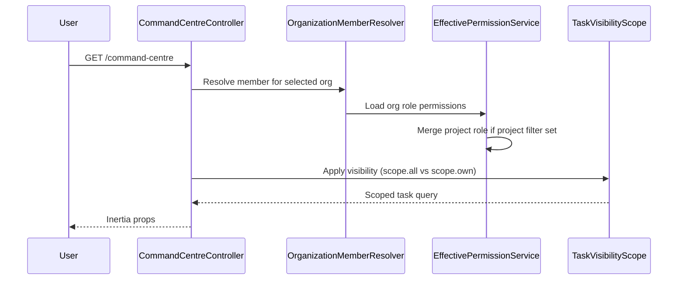
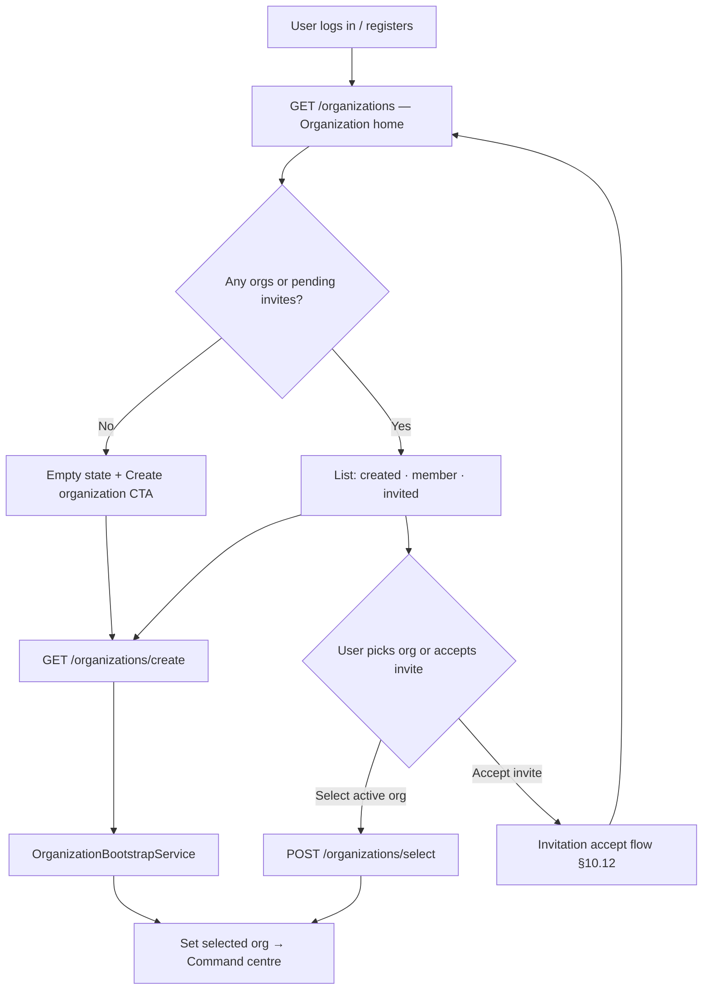
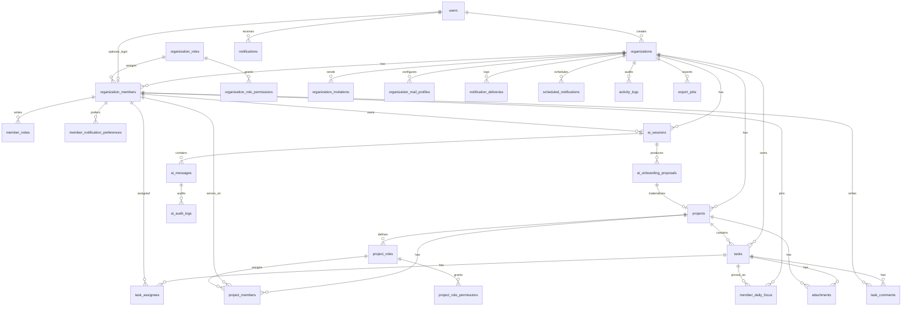

# TCM Command Centre — Technical Specification

**Document purpose:** Technical design for a multi-user project management / executive command centre, derived from the `TCM Group Dashboard.html` prototype.  
**Status:** Draft v5 — RBAC + production platform + AI project onboarding  
**Stack target:** Laravel 11+, Fortify, Inertia.js + React 19, custom org/project RBAC (Spatie-compatible permission slugs), Tailwind v4  
**Source artifact:** `TCM Group Dashboard.html` (root of repository)

---

## Table of Contents

1. [Executive Summary](#1-executive-summary)
2. [Domain Flow & Hierarchy](#2-domain-flow--hierarchy)
3. [Optimized Schema Overview](#3-optimized-schema-overview)
4. [Prototype Analysis](#4-prototype-analysis)
5. [Product Scope & Personas](#5-product-scope--personas)
6. [System Architecture](#6-system-architecture)
7. [Application Modules](#7-application-modules)
8. [Data Model (Tables)](#8-data-model-tables)
9. [Enums & Constants](#9-enums--constants)
10. [Business Rules & Domain Services](#10-business-rules--domain-services)
11. [Permissions & Authorization](#11-permissions--authorization)
12. [Query Scoping (View Own vs View All)](#12-query-scoping-view-own-vs-view-all)
13. [API & Routes](#13-api--routes)
14. [Request Validation](#14-request-validation)
15. [Frontend Mapping](#15-frontend-mapping)
16. [TypeScript Types](#16-typescript-types)
17. [Seed Data](#17-seed-data)
18. [Non-Functional Requirements](#18-non-functional-requirements)
19. [Implementation Phases](#19-implementation-phases)
20. [Laravel File Layout](#20-laravel-file-layout)
21. [Production Platform Modules](#21-production-platform-modules)
22. [AI Onboarding & Assistant](#22-ai-onboarding--assistant)
23. [Appendix A — Prototype Field Mapping](#appendix-a--prototype-field-mapping)
24. [Appendix B — ER Diagram](#appendix-b--er-diagram)
25. [Appendix C — Role Templates & Examples](#appendix-c--role-templates--examples)
26. [Appendix D — Full Route → Permission Matrix](#appendix-d--full-route--permission-matrix)
27. [Appendix E — Production Tables Reference](#appendix-e--production-tables-reference)

---

## 1. Executive Summary

The TCM Group Dashboard is a single-page **Command Centre** for executive leadership and chief-of-staff workflows. A production system replaces the prototype’s `localStorage` and fake user switcher with:

- **Real users** (Fortify signup/login) who **belong to one or more organizations** and can **create additional orgs**
- After login, users land on an **organization home** listing every org they **created**, are **assigned to**, or are **invited to** — then pick one to enter the command centre
- **Organization members** with **custom org roles & permissions**
- **Projects** per organization, each with **project team members** and **custom project roles & permissions**
- **One unified `tasks` table** for work items, reminders, and project decisions
- **Personal daily focus** as a lightweight link table (no duplicated task text)
- **Granular visibility**: members can be restricted to **own tasks only** or allowed to **view all org/project work**
- **Production platform**: org mail (SMTP/Gmail), in-app + email notifications, scheduled deadline reminders, invites, audit log, comments, attachments
- **AI project onboarding**: conversational wizard generates project metadata, tasks, decisions, and assignee mapping — human approves before commit
- **Automatic RBAC bootstrap**: creating an organization materializes all org role templates + permissions; creating a project materializes all project role templates + permissions in the same transaction

### Design principles (v5)

| Principle | Implementation |
|-----------|----------------|
| Fewer tables | Organization = company; all work under projects |
| **Single source of truth** | Task title, status, assignees live in `tasks` + `task_assignees`; daily focus only pins task IDs |
| **Clean hierarchy** | User → Organization → Members & Projects → Project team → Tasks |
| **Two-layer RBAC** | Org route permissions (baseline) + project route permissions (in-project actions) |
| **Route-level permissions** | One slug per controller action; roles assign exact subsets from `CommandCentrePermissionRegistry` |
| **Explicit scoping** | Separate `*.scope.all` / `*.scope.own` / `*.scope.member` slugs via visibility scopes |
| **Async delivery** | Email and scheduled reminders via Laravel queues; outbound mail logged in `notification_deliveries` |
| **Tenant mail identity** | Each organization configures its own SMTP or Gmail OAuth sender profile |
| **Bootstrap on create** | Org/project creation always runs a transactional bootstrap — roles, permissions, and default project team are never manual follow-up steps |
| **AI with guardrails** | AI proposes structured plans; database writes only after explicit user approval via `ApplyOnboardingProposal` |

### Goals

| Goal | Description |
|------|-------------|
| **Parity** | Match prototype UX: priorities, task table, projects, reminders, notes |
| **Multi-tenant** | Users can belong to many organizations (member/owner/invited); data isolated by `organization_id` |
| **Self-serve org creation** | Any authenticated user can create a new organization without belonging to one first |
| **Precise access control** | Route/function-level slugs per controller action; scope slugs for row visibility |
| **Stack alignment** | Laravel Form Requests, Inertia, Wayfinder, policy classes |
| **AI-assisted setup** | Laravel AI agents (mirror SiteGuard `app/Ai/`) for project onboarding and ongoing task assistance |

### Non-goals (v1)

- Offline-first mobile app
- Full Gantt / sprint planning
- Time tracking and billing
- Native Google Drive OAuth (URL on task only; **Drive OAuth integration deferred to Phase 4**)

---

## 2. Domain Flow & Hierarchy

### 4.1 Entity hierarchy

```
 User (account)
 └── belongs to zero or more → Organization (via organization_members)
 └── may create additional → Organization (owner_user_id + owner member row)
      ├── OrganizationMember (person in org; may or may not have login)
      │    ├── OrganizationRole → permissions (org-wide, materialized at org create)
      │    ├── MemberDailyFocus → pins tasks for "Today's Priorities"
      │    └── MemberNote → personal CEO notes
      ├── ai_sessions → AI onboarding / assist conversations
      └── Project
           ├── ProjectMember (links OrganizationMember + ProjectRole)
           │    └── ProjectRole → permissions (project-scoped, materialized at project create)
           ├── ai_onboarding_proposals → optional AI-generated plan before go-live
           └── Task (kind: task | reminder | decision)
                ├── project_id → Project (**required**)
                └── assignees → task_assignees → OrganizationMember (many)
```

### 4.2 Request flow (read task list)



### 4.3 Who can see what (summary)

| Resource | `*.scope.all` permission | `*.scope.own` / `*.scope.member` (default for members) |
|----------|----------------------|---------------------------------------------|
| Tasks (all kinds) | All tasks in visible projects | Tasks where member is in `task_assignees` or creator, within visible projects |
| Projects | All org projects | Only projects where I am on `project_members` |
| Reminders | All `kind=reminder` tasks | Own assignee row or created by me |
| Daily focus | Always **own** rows only | N/A — never cross-user |
| Notes | Always **own** rows only | N/A |

Org **Owner** role gets all org permissions. Project **Lead** role gets all project permissions for that project.

---

## 3. Optimized Schema Overview

### 3.1 Table inventory

**Core domain (13 tables + 1 pivot)**

| # | Table | Purpose |
|---|-------|---------|
| 1 | `users` | Auth accounts (existing) |
| 2 | `organizations` | **The company** — tenant boundary (e.g. TCM Group) |
| 3 | `organization_members` | People in that company |
| 4 | `organization_roles` | Custom roles per org |
| 5 | `organization_role_permissions` | Permission slugs per org role |
| 6 | `projects` | All strategic / operational work containers inside the company |
| 7 | `project_roles` | Custom roles per project |
| 8 | `project_role_permissions` | Permission slugs per project role |
| 9 | `project_members` | Project team + project role |
| 10 | `tasks` | Unified work: task, reminder, decision |
| 11 | `task_assignees` | Many assignees per task (pivot) |
| 12 | `member_daily_focus` | Today's priority pins |
| 13 | `member_notes` | Personal notes |

**Production platform (12 tables)** — see §8.14–§8.25 and [Appendix E](#appendix-e--production-tables-reference)

| # | Table | Purpose |
|---|-------|---------|
| 14 | `organization_invitations` | Email invite tokens + acceptance flow |
| 15 | `organization_mail_profiles` | Per-org SMTP / Gmail OAuth sending config (encrypted) |
| 16 | `member_notification_preferences` | Per-member event × channel toggles |
| 17 | `notifications` | Laravel in-app notifications (bell icon) |
| 18 | `notification_deliveries` | Outbound email log (sent / failed / retry) |
| 19 | `scheduled_notifications` | Future sends: deadline reminders, digests |
| 20 | `activity_logs` | Audit trail on tasks, projects, members |
| 21 | `task_comments` | Collaboration threads on tasks |
| 22 | `attachments` | Polymorphic file metadata (tasks, projects, comments) |
| 23 | `webhook_endpoints` | Outbound webhooks for integrations (Phase 4) |
| 24 | `organization_integrations` | Google Drive / Slack OAuth tokens (Phase 4) |
| 25 | `export_jobs` | Async CSV/PDF export tracking |

**AI & onboarding (4 tables)** — see §8.26–§8.29 and [§22](#22-ai-onboarding--assistant)

| # | Table | Purpose |
|---|-------|---------|
| 26 | `ai_sessions` | Conversational sessions (project onboarding, task assist) |
| 27 | `ai_messages` | User/assistant messages + tool metadata |
| 28 | `ai_onboarding_proposals` | Structured project plan pending human approval |
| 29 | `ai_audit_logs` | Tool-call audit for compliance |

**Framework (existing Laravel)** — not Command Centre–specific but required in production:

| Table | Purpose |
|-------|---------|
| `jobs`, `job_batches`, `failed_jobs` | Queue workers for mail + scheduled notifications |
| `cache`, `cache_locks` | Permission cache, rate limits |
| `sessions` | Web sessions |
| `password_reset_tokens` | Fortify password reset |

**Total Command Centre tables: 29** (+ framework tables above).

**No `business_units` or workstream fields.** Organization = company. **Every task belongs to exactly one project.**

### 3.4 Organization = company; tasks = always under a project

| Concept | Meaning |
|---------|---------|
| **Organization** | The company (TCM Group). Tenant boundary. |
| **Project** | All work lives here — tasks, reminders, and decisions **must** have `project_id`. |
| **Prototype “Company” filter** | Becomes **project filter** (Centrum work → Centrum project, etc.). |

**Why no org-level tasks?** Simpler model: one hierarchy `Organization → Project → Task`. The prototype’s loose org-wide task list maps to projects — including a default project such as **“Command Centre”** or **“General”** for miscellaneous items.

**Prototype mapping:**

| Prototype UI | Production |
|--------------|------------|
| Company filter chips (Centrum, TCM News, …) | Filter by **`project_id`** (create one project per vertical, or name projects accordingly) |
| Full task list | All tasks across visible projects |
| Strategic project grid | Same `projects` table; tasks nested under each project |

**Departments** remain out of scope. Daily focus pins a task; project comes from `tasks.project_id`.

### 3.5 Multiple assignees per task

| Rule | Detail |
|------|--------|
| Storage | `task_assignees(task_id, organization_member_id)` — many rows per task |
| UI | Person column shows multiple names/chips; multi-select from project team or org roster |
| Project tasks | Assignees should be members of that project’s team (`project_members`) — validated in Form Request |
| Org-level tasks | Assignees can be any active `organization_members` |
| Visibility (`org.tasks.scope.own`) | Member sees task if **they appear in `task_assignees`** or they created it |
| Assigned-to-me panel | Tasks where current member has a row in `task_assignees` |
| Auto daily focus | Creates focus pin for **each** assignee when deadline is today (configurable) |

### 3.2 Unified `tasks` kinds

| `kind` | Prototype UI | Notes |
|--------|--------------|-------|
| `task` | Full Task List | Requires `project_id` |
| `reminder` | Reminders card | Requires `project_id`; `meta.icon`, etc. |
| `decision` | Project decisions list | Requires `project_id` |

Follow-up auto-reminder = create `tasks` row with `kind=reminder`, `meta.source_task_id`.

### 3.3 Why this is cleaner

- **Organization = company** — one tenant.
- **All tasks → projects** — `project_id` required; no workstreams.
- **Many assignees** — `task_assignees` pivot.

---

## 4. Prototype Analysis

### 4.1 UI layout

```
┌─────────────────────────────────────────────────────────────────┐
│ TOPBAR: Logo · TCM Group · Role label · Date · User · Theme     │
├─────────────────────────────────────────────────────────────────┤
│ HEADER: Greeting + KPIs (Priorities · Open Tasks · Projects · Done) │
├──────────────────┬──────────────────────────────────────────────┤
│ LEFT COLUMN      │ RIGHT COLUMN                                  │
│ · Assigned (Nawal│ · Full Task List (filters: company, person)  │
│   only)          │ · Strategic Projects (3-col grid)             │
│ · Today's        │                                               │
│   Priorities     │                                               │
│ · Reminders      │                                               │
│ · CEO Notes      │                                               │
├──────────────────┴──────────────────────────────────────────────┤
│ BOTTOM BAR: open · done today · projects · saved indicator      │
└─────────────────────────────────────────────────────────────────┘
```

### 4.2 Functional modules

| # | Module | DOM / ID | Data scope | Max / limits |
|---|--------|----------|------------|--------------|
| 1 | Command header | `#greeting`, `#hs-*` | Session | — |
| 2 | Assigned by Talha | `#assigned-section` | Org tasks filtered to Nawal | Nawal view only |
| 3 | Today's Priorities | `#priority-list` | Per user | 10 active max |
| 4 | Full Task List | `#task-list` | Organization | — |
| 5 | Strategic Projects | `#project-grid` | Organization | — |
| 6 | Reminders | `#reminder-list` | Organization | — |
| 7 | CEO Notes | `#notes-list` | Per user | — |
| 8 | People roster | `#people-modal` | Organization | Manage assignable names |
| 9 | Theme | `#themeToggle` | Per browser | light / dark |

### 4.3 Prototype JavaScript entities

#### Priority (`priorities_T` / `priorities_N`)

```javascript
{
  id: number,
  text: string,
  company: string,      // e.g. "Centrum", "TCM Group"
  dept: string,         // e.g. "Finance", "Strategy"
  priority: string,     // "High" | "Medium" | "Low"
  done: boolean,
  auto?: boolean,       // synced from task
  taskId?: number       // source task when auto
}
```

#### Task (`tasks`)

```javascript
{
  id: number,
  name: string,
  person: string,       // assignee display name
  company: string,
  priority: string,
  deadline: string,     // "Today" | "This week" | "Apr 28" | "—"
  status: string,
  done: boolean,
  pinnedBy: string[],
  link: string          // Google Drive URL
}
```

#### Project (`projects`)

```javascript
{
  id: number,
  name: string,
  obj: string,          // objective
  pct: number,          // 0–100
  next: string,         // next action
  owner: string,        // free text
  color: string,        // psd-active | psd-progress | psd-steady
  decisions: string[],
  team: string[]        // display names
}
```

#### Reminder (`reminders`)

```javascript
{
  id: number,
  icon: string,
  text: string,
  sub: string,
  urgent: boolean,
  taskId?: number
}
```

#### Note

Array of strings per user (`notes_T`, `notes_N`).

#### People

Flat string array: `DEFAULT_PEOPLE`.

### 4.4 Prototype localStorage keys

| Key | Content |
|-----|---------|
| `tcm_user` | Active switcher user (`Talha` \| `Nawal`) |
| `tcm_theme` | `light` \| `dark` |
| `tcm3_p_talha` | Talha priorities JSON |
| `tcm3_p_nawal` | Nawal priorities JSON |
| `tcm3_tasks` | Tasks JSON |
| `tcm3_proj` | Projects JSON |
| `tcm3_rem` | Reminders JSON |
| `tcm3_n_talha` | Talha notes JSON |
| `tcm3_n_nawal` | Nawal notes JSON |
| `tcm3_people` | People roster JSON |

### 4.5 Prototype business logic (must preserve)

| Rule | Implementation in prototype | Production equivalent |
|------|----------------------------|------------------------|
| Priority cap | Block add when 10 active | DB validation + UI warning |
| Auto-priority | Tasks with `deadline === 'Today'` → priority row | `SyncMemberDailyFocus` → `member_daily_focus` |
| Auto-priority cleanup | Remove when task done or deadline changes | Task observer |
| Priority done → task done | If `auto && taskId`, mark task done | Toggle linked `tasks.is_done` |
| Task done → status | Sets `status = 'Done'` | Same on toggle |
| Follow-up → reminder | Status `Follow-up` creates reminder | `TaskStatusChangedListener` |
| Overdue | Parsed date > 5 days past | `DeadlineClassifier` on `deadline_date` |
| This week | Deadline within 7 days | Same |
| Assigned panel | Nawal sees tasks where `person === 'Nawal'` | Row in `task_assignees` for current member |
| Company / project filter | `data-f` on filter buttons | `?project_id=` (each chip = a project) |
| Person filter | Buttons from `people[]` | Filter by assignee via `task_assignees` |
| Progress bar click | Sets `pct` from click X position | PATCH `progress_percent` |
| Drag reorder priorities | Reorder active array | POST `/priorities/reorder` |

### 4.6 Company / business units (prototype)

Used in task filters and priority tags:

- Centrum
- TCM News
- TCM Group
- Studios
- Podcast
- Academy
- TCM Circle

### 4.7 Task statuses

`Pending` · `In Progress` · `Done` · `Stuck` · `Hold` · `Follow-up`

CSS mapping: `sp-pending`, `sp-progress`, `sp-done`, `sp-stuck`, `sp-hold`, `sp-followup`.

### 4.8 Priority levels

`High` · `Medium` · `Low`

### 4.9 Project health (status dot)

| Prototype class | Meaning | Production enum |
|-----------------|---------|-----------------|
| `psd-active` | Active / urgent (crimson) | `active` |
| `psd-progress` | In progress (blue) | `progressing` |
| `psd-steady` | Steady / on track (green) | `steady` |

---

## 5. Product Scope & Personas

### 5.0 Account signup & organization access

Every user starts with a **Fortify account** (`users` table). Organization access is **never** implicit — it always flows through `organization_members` and/or `organization_invitations`.

#### How a user gets organizations

| Source | How it appears | `organization_members` | Access to command centre |
|--------|----------------|--------------------------|---------------------------|
| **Created** | User completes **Create organization** wizard | Row with `owner` role, `status=active`; `is_primary_org=true` only if user's first org | Immediate |
| **Assigned** | Admin adds existing user to org roster | Row with chosen org role, `user_id` set, `status=active` | Immediate |
| **Invited (pending)** | Admin sends invite to user's email | Row may exist with `status=invited`, or only `organization_invitations` until accept | **Blocked** until invite accepted |
| **Invited (accepted)** | User clicks invite link → login/register → accept | Row linked, `status=active`, `joined_at` set | Immediate |

A single user may have **multiple rows** in `organization_members` (one per org). Creating a second org does not remove membership in the first.

#### Post-login flow



**Organization home** (`/organizations`) is the default authenticated landing page (replace generic `/dashboard` for Command Centre users). It shows:

- All **accessible** organizations (see query below)
- Membership badge: **Owner** · **Member** · **Invited**
- **Create organization** button (always visible when authenticated)
- Pending invitations with **Accept** / **Decline** actions

**Org switcher** in the app topbar reuses the same list; changing selection updates session and reloads command centre scoped to that tenant.

#### `SelectedOrganizationManager` (mirror `SelectedSiteManager`)

```php
final class SelectedOrganizationManager
{
    public const string SESSION_KEY = 'selected_organization_id';

    /** Orgs the user may enter (active membership) or see as invited. */
    public function accessibleOrganizationsQuery(User $user): Builder;

    /** Active memberships only — for command centre routes. */
    public function activeMembershipsQuery(User $user): Builder;

    public function resolveSelectedOrganization(Request $request): ?Organization;

    public function requireSelectedOrganization(Request $request): Organization;

    /** @return array{selectedOrganization: ..., organizations: ..., pendingInvitations: ...} */
    public function sharedContext(Request $request): array;
}
```

**Resolution order** for `selected_organization_id`:

1. Session value if user still has **active** membership in that org
2. Else `organization_members.is_primary_org = true` (among active memberships)
3. Else first active membership ordered by org name
4. If none → redirect to `/organizations` (home), not command centre

**Accessible organizations query** (for home list):

```sql
-- Active memberships (created, assigned, accepted invite)
SELECT o.*, om.status, om.organization_role_id, 'member' AS list_type
FROM organizations o
JOIN organization_members om ON om.organization_id = o.id
WHERE om.user_id = :user_id AND om.status = 'active'

UNION DISTINCT

-- Pending invites (member row invited OR invitation email match)
SELECT o.*, 'invited' AS list_type ...
WHERE om.user_id = :user_id AND om.status = 'invited'
   OR EXISTS (organization_invitations WHERE email = user.email AND status = 'pending')
```

Command centre and all `/organizations/{organization}/…` routes require `organization_members.status = active` (`EnsureOrganizationMember` middleware).

#### Creating a new organization

Any authenticated user — **no prior org membership required**.

```
GET  /organizations/create   → Inertia org wizard (name, timezone, optional AI assist)
POST /organizations          → OrganizationBootstrapService (§10.5)
                             → set selected_organization_id
                             → redirect organizations.command-centre.index
```

User may create unlimited orgs; each gets its own role template bootstrap. Only the **first** org sets `is_primary_org=true` on the creator's member row.

---

### 5.1 Core user journeys

| Journey | Actor | Flow |
|---------|-------|------|
| Sign up & land | New user | Register (Fortify) → email verify (if enabled) → **Organization home** lists orgs (empty on first visit) |
| Create workspace | Any authenticated user | Organization home → **Create organization** → bootstrap roles → enter command centre |
| Join via invite | Invited user | Email link → register/login → accept → org appears on home → enter command centre |
| Switch organization | Multi-org user | Topbar org switcher or home → select org → session updated → command centre reloads |
| AI project setup | Org lead / owner | **Project onboarding wizard** → describe goals → add team → AI proposes plan → review → **Apply** → project + roles + tasks + assignees created atomically |
| Run command centre | Org member | Organization home or switcher → select org → dashboard loads scoped by permissions |
| Manage project | Project Lead | Open project → Manage team roles → Create/assign tasks |
| Daily focus | Any member | Pin tasks to today (max 10) → Reorder → Complete |
| Restricted member | Custom role | Sees only assigned tasks + member projects only |
| AI task assist | Contributor | Inside project → ask AI to draft tasks from brief → review proposal → apply selected items |

### 5.2 Role templates & bootstrap (mandatory on create)

Role definitions live in code (`CommandCentreRoleTemplateRegistry`) — **not** ad-hoc at runtime. On every org/project create, templates are **materialized into tenant tables** inside a DB transaction.

| Event | Service | What gets created |
|-------|---------|-------------------|
| **Organization created** | `OrganizationBootstrapService` | 5 org roles (`owner`, `admin`, `lead`, `member`, `viewer`) + all permission rows from §11.9; creator → `owner` member; default `member_notification_preferences`; optional default **Command Centre** catch-all project |
| **Project created** (manual or AI) | `ProjectBootstrapService` | 4 project roles (`project_owner`, `project_lead`, `contributor`, `project_viewer`) + all permission rows; creator → `project_owner` on `project_members`; if AI/manual onboarding supplied team → `project_members` rows with mapped roles |
| **AI proposal applied** | `ApplyOnboardingProposal` | Runs `ProjectBootstrapService` then bulk-inserts tasks, assignees, decisions from approved payload |

**Invariant:** No org exists without at least the system org roles. No project exists without at least the system project roles. Permissions are copied from the registry slug lists — not inherited live from code after creation (allows per-tenant customization later).

### 5.3 Default org roles (seed templates — materialized on org create)

| Role slug | Purpose | Typical permissions |
|-----------|---------|---------------------|
| `owner` | Org creator / CEO | All org permissions |
| `admin` | Operations admin | All org slugs except `org.organizations.destroy` |
| `lead` | Department head | `org.tasks.scope.all`, `org.projects.scope.all`, member/role management slugs (§11.9) |
| `member` | Individual contributor | `org.tasks.scope.own`, `org.projects.scope.member`, task/focus/note route slugs |
| `viewer` | Read-only executive | Index/show slugs + `org.tasks.scope.all`, no store/update/destroy |

Organizations can **rename**, **duplicate**, or **create custom roles** with any subset of permissions from the catalog (§11). System role **slugs** remain immutable; permission rows are editable.

### 5.4 Default project roles (materialized on every project create)

| Role slug | Purpose | Typical permissions |
|-----------|---------|---------------------|
| `project_owner` | Accountable exec | All project permissions |
| `project_lead` | Day-to-day lead | Manage tasks, members, decisions |
| `contributor` | Executes work | `project.tasks.scope.own`, `project.tasks.update`, assignee sync |
| `project_viewer` | Stakeholder | `project.tasks.index`, `project.tasks.show`, `project.tasks.scope.own` |

Each project stores its **own** `project_roles` rows (materialized from templates at create time) so permissions can diverge per project without affecting other projects.

---

## 6. System Architecture

### 6.1 Layers

```
┌─────────────────────────────────────────────────────────────┐
│ React / Inertia — command-centre, org settings, project view │
└────────────────────────────┬────────────────────────────────┘
                             │
┌────────────────────────────▼────────────────────────────────┐
│ HTTP — Controllers + Form Requests + Policies                │
│ Support — EffectivePermissionService, VisibilityScopes       │
│ AI — Agents + Tools (onboarding proposals, no direct writes) │
└────────────────────────────┬────────────────────────────────┘
                             │
┌────────────────────────────▼────────────────────────────────┐
│ MySQL / PostgreSQL — 13 tables, org_id on all tenant data    │
└─────────────────────────────────────────────────────────────┘
```

### 6.2 Session & organization context

| Context key | Purpose |
|-------------|---------|
| `selected_organization_id` | Current tenant in session (`SelectedOrganizationManager::SESSION_KEY`) |
| `organization_member_id` | Resolved once per request for selected org — cache on request |
| `project_id` (optional) | When viewing a single project |

**Shared Inertia props** (via `HandleInertiaRequests`, mirror SiteGuard `siteContext`):

```typescript
organizationContext: {
    selectedOrganization: { id: number; name: string; slug: string; role: { name: string; slug: string } } | null;
    organizations: Array<{
        id: number;
        name: string;
        slug: string;
        membership: 'owner' | 'member' | 'invited';
        member_status: 'active' | 'invited';
        is_primary_org: boolean;
    }>;
    pendingInvitations: Array<{
        id: number;
        organization_name: string;
        role_name: string;
        expires_at: string;
    }>;
};
```

**Middleware chain:**

| Middleware | When | Rule |
|------------|------|------|
| `auth` | All app routes | User logged in |
| `EnsureOrganizationAccess` | `{organization}` routes | Org exists; user has **active** `organization_members` row OR is `owner_user_id` with active member row |
| `EnsureOrganizationMember` | Nested org routes | Resolves `organization_member_id`; 403 if `status != active` |
| *(none beyond auth)* | `GET /organizations`, `POST /organizations`, `POST /organizations/select` | User-scoped, no tenant selected yet |

### 6.3 Permission evaluation order

1. User authenticated and `organization_members.status = active`
2. Load **org role** permissions for member
3. If action is on a **project** resource: require `project_members` row + **project role** permissions
4. Effective grant = org allows **AND** (not project-scoped **OR** project allows)
5. Apply **visibility scope** (`*.scope.all` vs `*.scope.own` / `*.scope.member`) on queries

**Deny wins:** if org role lacks `org.tasks.scope.all`, user never sees others' tasks at org level even with a permissive project role (project can only narrow or add within allowed projects).

---

## 7. Application Modules

| Module | Primary tables | Notes |
|--------|----------------|-------|
| **Organizations** | `organizations`, `organization_members` | User home lists accessible orgs; create adds new tenant |
| **Members & invites** | `organization_members`, `organization_roles` | Roster + auth linkage |
| **Org RBAC** | `organization_roles`, `organization_role_permissions` | Custom per org |
| **Projects** | `projects`, `project_members`, … | Strategic work inside the company |
| **Tasks** | `tasks`, `task_assignees` | Unified work; multiple assignees |
| **Daily focus** | `member_daily_focus` | Priority pins |
| **Notes** | `member_notes` | Personal |
| **Command centre** | Aggregates above | Dashboard KPIs |
| **Invitations** | `organization_invitations` | Token-based member onboarding |
| **Mail & delivery** | `organization_mail_profiles`, `notification_deliveries` | SMTP/Gmail config + send log |
| **Notifications** | `notifications`, `scheduled_notifications`, `member_notification_preferences` | In-app bell + email + cron reminders |
| **Collaboration** | `task_comments`, `attachments` | Comments and file uploads on tasks |
| **Audit & exports** | `activity_logs`, `export_jobs` | Compliance trail + async reports |
| **Integrations** | `webhook_endpoints`, `organization_integrations` | Webhooks, Google Drive (Phase 4) |
| **AI onboarding** | `ai_sessions`, `ai_messages`, `ai_onboarding_proposals`, `ai_audit_logs` | Project wizard + conversational assistant |
| **Role bootstrap** | `organization_roles`, `project_roles`, permission pivots | `OrganizationBootstrapService`, `ProjectBootstrapService` |

---

## 8. Data Model (Tables)

### 8.1 `users` (existing)

Laravel Fortify user. No schema change required.

**Relationships:**

- `organizations()` — hasMany through `organization_members` (active memberships)
- `ownedOrganizations()` — hasMany where `organizations.owner_user_id = users.id`
- `pendingInvitations()` — hasMany `organization_invitations` where `email = users.email` and `status = pending`

Post-login, the app never assumes a single org per user — always resolve via `SelectedOrganizationManager`.

---

### 8.2 `organizations`

| Column | Type | Notes |
|--------|------|-------|
| `id` | bigint PK | |
| `name` | varchar(255) | |
| `slug` | varchar(255) UNIQUE | |
| `logo_path` | varchar(255) NULL | |
| `owner_user_id` | bigint FK → users | Creator |
| `settings` | json | `{ focus_cap, timezone, auto_focus_enabled, notifications, ai_enabled }` |
| `created_at`, `updated_at` | timestamps | |

---

### 8.3 `organization_members`

**Single table for roster, assignees, and team.** Replaces separate directory + pivot.

| Column | Type | Notes |
|--------|------|-------|
| `id` | bigint PK | Used as FK in members, assignees, project team |
| `organization_id` | bigint FK | |
| `user_id` | bigint FK NULL | NULL = roster-only (no login yet) |
| `organization_role_id` | bigint FK | Org-level role |
| `display_name` | varchar(255) | Shown in UI; defaults from user.name |
| `email` | varchar(255) NULL | For invites |
| `title` | varchar(255) NULL | e.g. "CEO Command Centre" |
| `status` | enum | `active`, `invited`, `disabled` |
| `is_primary_org` | boolean | User's default org when switching sessions (one per user among active memberships) |
| `sort_order` | smallint | Person filter order |
| `invited_at`, `joined_at` | timestamps NULL | |
| `created_at`, `updated_at` | timestamps | |

**Indexes:** UNIQUE `(organization_id, user_id)` where user_id NOT NULL; INDEX `(organization_id, status)`

---

### 8.4 `organization_roles`

Custom roles **per organization**.

| Column | Type | Notes |
|--------|------|-------|
| `id` | bigint PK | |
| `organization_id` | bigint FK | |
| `name` | varchar(255) | Display: "Owner", "Member" |
| `slug` | varchar(100) | `owner`, `member`, custom |
| `description` | text NULL | |
| `is_system` | boolean | Seed roles; slug immutable |
| `sort_order` | smallint | |
| `created_at`, `updated_at` | timestamps | |

**Indexes:** UNIQUE `(organization_id, slug)`

---

### 8.5 `organization_role_permissions`

| Column | Type | Notes |
|--------|------|-------|
| `id` | bigint PK | |
| `organization_role_id` | bigint FK CASCADE | |
| `permission` | varchar(100) | Slug from catalog §11 |

**Indexes:** UNIQUE `(organization_role_id, permission)`

---

### 8.6 `projects`

| Column | Type | Notes |
|--------|------|-------|
| `id` | bigint PK | |
| `organization_id` | bigint FK | |
| `name` | varchar(255) | |
| `objective` | text | |
| `progress_percent` | tinyint | 0–100 |
| `next_action` | text NULL | |
| `health` | enum | active, progressing, steady |
| `owner_member_id` | bigint FK → organization_members NULL | |
| `created_by_member_id` | bigint FK | |
| `sort_order` | smallint | |
| `archived_at` | timestamp NULL | |
| `created_at`, `updated_at` | timestamps | |

---

### 8.7 `project_roles`

Custom roles **per project** (materialized from templates at project creation).

| Column | Type | Notes |
|--------|------|-------|
| `id` | bigint PK | |
| `project_id` | bigint FK CASCADE | |
| `name` | varchar(255) | |
| `slug` | varchar(100) | |
| `is_default` | boolean | Assigned to creator |
| `sort_order` | smallint | |

**Indexes:** UNIQUE `(project_id, slug)`

---

### 8.8 `project_role_permissions`

| Column | Type | Notes |
|--------|------|-------|
| `id` | bigint PK | |
| `project_role_id` | bigint FK CASCADE | |
| `permission` | varchar(100) | From project catalog §11 |

**Indexes:** UNIQUE `(project_role_id, permission)`

---

### 8.9 `project_members`

| Column | Type | Notes |
|--------|------|-------|
| `id` | bigint PK | |
| `project_id` | bigint FK CASCADE | |
| `organization_member_id` | bigint FK | Must belong to same org |
| `project_role_id` | bigint FK | |
| `joined_at` | timestamp | |

**Indexes:** UNIQUE `(project_id, organization_member_id)`

---

### 8.10 `tasks` (unified work table)

| Column | Type | Notes |
|--------|------|-------|
| `id` | bigint PK | |
| `organization_id` | bigint FK | |
| `project_id` | bigint FK NOT NULL → projects | **Every task belongs to a project** |
| `kind` | enum | `task`, `reminder`, `decision` |
| `title` | varchar(500) | |
| `description` | text NULL | Subtitle for reminders |
| `created_by_member_id` | bigint FK | |
| `priority` | enum NULL | high, medium, low — null for decisions |
| `status` | enum | pending, in_progress, done, stuck, hold, follow_up |
| `deadline_type` | enum NULL | none, today, this_week, date |
| `deadline_date` | date NULL | |
| `deadline_label` | varchar(100) NULL | |
| `external_link` | varchar(2048) NULL | |
| `is_done` | boolean | |
| `completed_at` | timestamp NULL | |
| `completed_by_member_id` | bigint FK NULL | |
| `meta` | json NULL | See below |
| `sort_order` | int NULL | Decisions within project |
| `created_at`, `updated_at` | timestamps | |
| `deleted_at` | timestamp NULL | Soft delete |

**`meta` JSON by kind:**

```json
// reminder
{ "icon": "🔔", "is_urgent": true, "source_task_id": 123 }

// decision (optional)
{ "is_resolved": false }
```

**Indexes:**

- `(organization_id, kind, is_done)`
- `(project_id, kind, is_done)`
- `(organization_id, deadline_date)`

---

### 8.11 `task_assignees`

**Multiple team members per task.** Replaces single `assignee_member_id`.

| Column | Type | Notes |
|--------|------|-------|
| `task_id` | bigint FK → tasks CASCADE | |
| `organization_member_id` | bigint FK → organization_members CASCADE | |
| `is_primary` | boolean DEFAULT false | Optional UI default; not required |
| `assigned_at` | timestamp | |
| `assigned_by_member_id` | bigint FK NULL | |

**PK:** `(task_id, organization_member_id)`

**Indexes:** INDEX `(organization_member_id)` — fast “assigned to me” queries

**Validation:**

- If `tasks.project_id` IS NOT NULL → each assignee must exist in `project_members` for that project.
- If `tasks.kind = decision` → assignees optional (decisions often unassigned).
- At least one assignee recommended for `kind = task` (app-level warning, not DB constraint).

---

### 8.12 `member_daily_focus`

Replaces `daily_priorities` — **no duplicated title**.

| Column | Type | Notes |
|--------|------|-------|
| `id` | bigint PK | |
| `organization_member_id` | bigint FK | Whose focus list |
| `task_id` | bigint FK → tasks | Must be `kind=task` |
| `focus_date` | date | Today’s list |
| `sort_order` | smallint | Drag order |
| `is_auto` | boolean | Synced from deadline=today |
| `created_at`, `updated_at` | timestamps | |

**Indexes:** UNIQUE `(organization_member_id, task_id, focus_date)`; INDEX `(organization_member_id, focus_date, task_id)`

**Cap rule:** count rows join tasks where `tasks.is_done = false` ≤ org `focus_cap`.

---

### 8.13 `member_notes`

| Column | Type | Notes |
|--------|------|-------|
| `id` | bigint PK | |
| `organization_member_id` | bigint FK | Owner |
| `body` | text | |
| `sort_order` | smallint | |
| `created_at`, `updated_at` | timestamps | |

---

## 8A. Production Platform Tables

Tables required beyond the core PM domain for invites, mail, notifications, collaboration, audit, and integrations.

### 8.14 `organization_invitations`

Token-based onboarding when `organization_members.user_id` is NULL until accepted.

| Column | Type | Notes |
|--------|------|-------|
| `id` | bigint PK | |
| `organization_id` | bigint FK | |
| `email` | varchar(255) | Invite recipient |
| `organization_role_id` | bigint FK | Role granted on accept |
| `invited_by_member_id` | bigint FK → organization_members | |
| `token_hash` | varchar(64) | SHA-256 of single-use token (never store raw token) |
| `status` | enum | `pending`, `accepted`, `expired`, `revoked` |
| `expires_at` | timestamp | Default 7 days |
| `accepted_at` | timestamp NULL | |
| `organization_member_id` | bigint FK NULL | Populated after accept |
| `created_at`, `updated_at` | timestamps | |

**Indexes:** UNIQUE `(organization_id, email)` WHERE status = pending; INDEX `(token_hash)`; INDEX `(expires_at)`

**Flow:** `POST org.members.store` with email → create invitation + send `MemberInvitedMail` → accept link creates/links `users` row + `organization_members`.

---

### 8.15 `organization_mail_profiles`

Per-organization outbound mail identity. Secrets stored encrypted (`config` cast via `encrypted:array`). Mirror SiteGuard `notification_channels` pattern but scoped to `organization_id`.

| Column | Type | Notes |
|--------|------|-------|
| `id` | bigint PK | |
| `organization_id` | bigint FK | |
| `name` | varchar(255) | Label: "TCM Alerts", "HR Notifications" |
| `provider` | enum | `smtp`, `gmail_oauth`, `microsoft_oauth` |
| `is_default` | boolean | One default per org |
| `from_name` | varchar(255) | |
| `from_address` | varchar(255) | Must match verified sender |
| `reply_to_address` | varchar(255) NULL | |
| `config` | json encrypted | Provider-specific — see below |
| `is_verified` | boolean | Set after successful test send |
| `last_tested_at` | timestamp NULL | |
| `is_active` | boolean | |
| `created_by_member_id` | bigint FK | |
| `created_at`, `updated_at` | timestamps | |

**`config` by provider:**

```json
// smtp
{
  "host": "smtp.gmail.com",
  "port": 587,
  "encryption": "tls",
  "username": "alerts@tcmgroup.com",
  "password": "<encrypted>"
}

// gmail_oauth (Google Workspace / Gmail API)
{
  "client_id": "...",
  "client_secret": "<encrypted>",
  "refresh_token": "<encrypted>",
  "access_token": "<encrypted>",
  "token_expires_at": "2026-06-01T12:00:00Z",
  "google_user_email": "alerts@tcmgroup.com"
}
```

**Runtime:** `OrganizationMailerResolver` picks default active profile → builds Laravel `Mailer` via `config/mail.mailers.organization_{id}` registered at boot or per-send `Mail::mailer()`.

**Fallback:** If no org profile, use app-level `.env` `MAIL_*` (platform default) — logged as `notification_deliveries.provider = platform`.

---

### 8.16 `member_notification_preferences`

Per-member opt-in/out by event and channel. Seeded with sensible defaults on member create.

| Column | Type | Notes |
|--------|------|-------|
| `id` | bigint PK | |
| `organization_member_id` | bigint FK CASCADE | |
| `event_type` | varchar(100) | From `NotificationEventType` enum |
| `channel` | enum | `database`, `mail` |
| `is_enabled` | boolean | |
| `created_at`, `updated_at` | timestamps | |

**Indexes:** UNIQUE `(organization_member_id, event_type, channel)`

**UI:** Settings → Notifications — matrix of event types × channels.

---

### 8.17 `notifications`

Laravel standard database notifications table. Notifiable = `User` (member resolves `user_id`).

| Column | Type | Notes |
|--------|------|-------|
| `id` | uuid PK | |
| `type` | varchar(255) | Notification class FQCN |
| `notifiable_type` | varchar(255) | `App\Models\User` |
| `notifiable_id` | bigint | |
| `data` | json | `{ title, body, action_url, organization_id, task_id, ... }` |
| `read_at` | timestamp NULL | |
| `created_at`, `updated_at` | timestamps | |

**Indexes:** INDEX `(notifiable_type, notifiable_id, read_at)`

**UI:** Topbar bell → `GET org.notifications.index` → mark read via `PATCH org.notifications.mark-read`.

---

### 8.18 `notification_deliveries`

Outbound delivery log for email (and optional SMS later). Supports retry and admin troubleshooting.

| Column | Type | Notes |
|--------|------|-------|
| `id` | bigint PK | |
| `organization_id` | bigint FK | |
| `organization_mail_profile_id` | bigint FK NULL | NULL = platform mailer |
| `organization_member_id` | bigint FK NULL | Recipient member |
| `recipient_user_id` | bigint FK NULL | Denormalized for queries |
| `recipient_email` | varchar(255) | |
| `channel` | enum | `mail`, `database` |
| `notification_class` | varchar(255) | e.g. `TaskDueSoonNotification` |
| `event_type` | varchar(100) | |
| `subject` | varchar(500) NULL | |
| `payload` | json | Redacted snapshot (no secrets) |
| `subject_type`, `subject_id` | morph NULL | Task, Invitation, etc. |
| `status` | enum | `queued`, `sent`, `failed`, `bounced`, `suppressed` |
| `provider_message_id` | varchar(255) NULL | SMTP Message-ID / Gmail id |
| `error_message` | text NULL | |
| `attempts` | tinyint DEFAULT 0 | |
| `queued_at`, `sent_at`, `failed_at` | timestamps NULL | |
| `created_at`, `updated_at` | timestamps | |

**Indexes:** INDEX `(organization_id, status, created_at)`; INDEX `(organization_member_id, created_at)`

**Suppressed:** Member disabled mail for event in preferences → status `suppressed`, no send.

---

### 8.19 `scheduled_notifications`

Deferred notifications processed by `notifications:dispatch-scheduled` Artisan command (every minute via scheduler).

| Column | Type | Notes |
|--------|------|-------|
| `id` | bigint PK | |
| `organization_id` | bigint FK | |
| `organization_member_id` | bigint FK | Recipient |
| `event_type` | varchar(100) | e.g. `task_due_soon`, `daily_digest` |
| `channel` | enum | `mail`, `database` |
| `subject_type`, `subject_id` | morph | Usually `Task` |
| `trigger_at` | timestamp | Org timezone applied at schedule time |
| `payload` | json | Template variables |
| `dedupe_key` | varchar(255) UNIQUE | e.g. `task:42:due_soon:member:7:2026-05-31` |
| `status` | enum | `pending`, `processing`, `sent`, `cancelled`, `failed` |
| `notification_delivery_id` | bigint FK NULL | After send |
| `cancelled_at` | timestamp NULL | Task done / deadline changed |
| `created_at`, `updated_at` | timestamps | |

**Indexes:** INDEX `(status, trigger_at)` — worker query

**Schedule sources:**

| Trigger | When scheduled |
|---------|----------------|
| Task deadline | 1 day before, day-of morning (org settings) |
| Overdue task | Daily at 09:00 org time while open |
| Daily digest | Weekdays 07:00 — open tasks + focus pins |
| Focus cap warning | When auto-focus adds 9th pin |

---

### 8.20 `activity_logs`

Immutable audit trail for compliance and "who changed what".

| Column | Type | Notes |
|--------|------|-------|
| `id` | bigint PK | |
| `organization_id` | bigint FK | |
| `actor_member_id` | bigint FK NULL | NULL = system |
| `subject_type`, `subject_id` | morph | Task, Project, OrganizationMember, … |
| `event` | varchar(100) | `task.created`, `task.status_changed`, `member.invited`, … |
| `properties` | json | `{ "old": {...}, "new": {...}, "ip": "..." }` |
| `created_at` | timestamp | No `updated_at` — append-only |

**Indexes:** INDEX `(organization_id, subject_type, subject_id, created_at)`; INDEX `(organization_id, created_at)`

**Written by:** Model observers + explicit `ActivityLogger::log()` in controllers for RBAC changes.

---

### 8.21 `task_comments`

Threaded discussion on tasks (production collaboration minimum).

| Column | Type | Notes |
|--------|------|-------|
| `id` | bigint PK | |
| `task_id` | bigint FK CASCADE | |
| `organization_member_id` | bigint FK | Author |
| `parent_id` | bigint FK NULL → task_comments | Reply threading |
| `body` | text | Markdown allowed |
| `edited_at` | timestamp NULL | |
| `created_at`, `updated_at` | timestamps | |
| `deleted_at` | timestamp NULL | Soft delete |

**Indexes:** INDEX `(task_id, created_at)`; INDEX `(parent_id)`

**Side effects:** On create → notify assignees (`task_comment_added`) unless author is only assignee.

---

### 8.22 `attachments`

Polymorphic file storage metadata. Binary on `local` / `s3` disk per env.

| Column | Type | Notes |
|--------|------|-------|
| `id` | bigint PK | |
| `organization_id` | bigint FK | Tenant guard |
| `attachable_type`, `attachable_id` | morph | Task, Project, TaskComment |
| `uploaded_by_member_id` | bigint FK | |
| `disk` | varchar(50) | `local`, `s3` |
| `path` | varchar(500) | Storage path |
| `original_filename` | varchar(255) | |
| `mime_type` | varchar(100) | |
| `size_bytes` | bigint | Max 25 MB default |
| `created_at`, `updated_at` | timestamps | |
| `deleted_at` | timestamp NULL | |

**Indexes:** INDEX `(attachable_type, attachable_id)`; INDEX `(organization_id)`

---

### 8.23 `webhook_endpoints` (Phase 4)

| Column | Type | Notes |
|--------|------|-------|
| `id` | bigint PK | |
| `organization_id` | bigint FK | |
| `name` | varchar(255) | |
| `url` | varchar(2048) | HTTPS only |
| `secret` | varchar(255) encrypted | HMAC signing |
| `events` | json | Subscribed `NotificationEventType` values |
| `is_active` | boolean | |
| `last_triggered_at` | timestamp NULL | |
| `last_failure_at` | timestamp NULL | |
| `created_at`, `updated_at` | timestamps | |

---

### 8.24 `organization_integrations` (Phase 4)

OAuth connections for Google Drive picker, Slack, etc.

| Column | Type | Notes |
|--------|------|-------|
| `id` | bigint PK | |
| `organization_id` | bigint FK | |
| `provider` | enum | `google_drive`, `slack`, `microsoft_teams` |
| `config` | json encrypted | OAuth tokens + scopes |
| `connected_by_member_id` | bigint FK | |
| `connected_at` | timestamp | |
| `revoked_at` | timestamp NULL | |
| `created_at`, `updated_at` | timestamps | |

**Indexes:** UNIQUE `(organization_id, provider)` WHERE revoked_at IS NULL

---

### 8.25 `export_jobs`

Async export tracking (task list CSV, project report PDF).

| Column | Type | Notes |
|--------|------|-------|
| `id` | bigint PK | |
| `organization_id` | bigint FK | |
| `requested_by_member_id` | bigint FK | |
| `export_type` | enum | `tasks_csv`, `projects_csv`, `activity_csv` |
| `filters` | json | Query params snapshot |
| `status` | enum | `pending`, `processing`, `completed`, `failed` |
| `disk` | varchar(50) | |
| `path` | varchar(500) NULL | Download path when done |
| `error_message` | text NULL | |
| `expires_at` | timestamp | Auto-delete file after 24h |
| `completed_at` | timestamp NULL | |
| `created_at`, `updated_at` | timestamps | |

---

## 8B. AI & Onboarding Tables

Mirror SiteGuard `ai_sessions` / `ai_messages` / `ai_audit_logs` pattern, scoped to `organization_id` with project-onboarding context.

### 8.26 `ai_sessions`

| Column | Type | Notes |
|--------|------|-------|
| `id` | bigint PK | |
| `organization_id` | bigint FK | Tenant boundary |
| `organization_member_id` | bigint FK | Session owner |
| `user_id` | bigint FK | Denormalized from member |
| `context` | enum | `project_onboarding`, `project_assist`, `org_onboarding` |
| `project_id` | bigint FK NULL | Set after proposal applied |
| `title` | varchar(255) NULL | Auto from first user message |
| `status` | enum | `active`, `completed`, `abandoned` |
| `last_message_at` | timestamp NULL | |
| `created_at`, `updated_at` | timestamps | |

**Indexes:** INDEX `(organization_id, organization_member_id, context, status)`

---

### 8.27 `ai_messages`

| Column | Type | Notes |
|--------|------|-------|
| `id` | bigint PK | |
| `ai_session_id` | bigint FK CASCADE | |
| `role` | enum | `user`, `assistant`, `system`, `tool` |
| `content` | text NULL | Markdown |
| `proposed_actions` | json NULL | Structured deltas (task drafts, role hints) |
| `onboarding_proposal_id` | bigint FK NULL → ai_onboarding_proposals | Link when assistant emits full plan |
| `created_at`, `updated_at` | timestamps | |

---

### 8.28 `ai_onboarding_proposals`

Structured plan **awaiting human approval**. AI never writes tasks/projects directly — only inserts/updates this table until `ApplyOnboardingProposal` runs.

| Column | Type | Notes |
|--------|------|-------|
| `id` | bigint PK | |
| `ai_session_id` | bigint FK | |
| `organization_id` | bigint FK | |
| `created_by_member_id` | bigint FK | |
| `proposal_type` | enum | `project`, `org` |
| `status` | enum | `draft`, `pending_review`, `approved`, `applied`, `rejected`, `superseded` |
| `payload` | json | Full structured plan — schema §22.4 |
| `summary` | text NULL | Human-readable executive summary from AI |
| `project_id` | bigint FK NULL | Populated when `status=applied` |
| `applied_at` | timestamp NULL | |
| `applied_by_member_id` | bigint FK NULL | |
| `rejection_reason` | text NULL | |
| `version` | smallint DEFAULT 1 | Incremented on regenerate |
| `created_at`, `updated_at` | timestamps | |

**Indexes:** INDEX `(organization_id, status)`; INDEX `(ai_session_id, version DESC)`

---

### 8.29 `ai_audit_logs`

Tool invocation audit (compliance + debugging).

| Column | Type | Notes |
|--------|------|-------|
| `id` | bigint PK | |
| `ai_message_id` | bigint FK → ai_messages | |
| `organization_id` | bigint FK | |
| `tool_name` | varchar(100) | e.g. `list_organization_members` |
| `tool_input` | json | Redacted — no secrets |
| `tool_output` | json NULL | Truncated if large |
| `llm_model` | varchar(100) NULL | |
| `latency_ms` | int NULL | |
| `created_at` | timestamp | Append-only |

---

## 9. Enums & Constants

```php
enum MemberStatus: string { case Active = 'active'; case Invited = 'invited'; case Disabled = 'disabled'; }
enum TaskKind: string { case Task = 'task'; case Reminder = 'reminder'; case Decision = 'decision'; }
enum TaskStatus: string { case Pending = 'pending'; case InProgress = 'in_progress'; case Done = 'done'; case Stuck = 'stuck'; case Hold = 'hold'; case FollowUp = 'follow_up'; }
enum PriorityLevel: string { case High = 'high'; case Medium = 'medium'; case Low = 'low'; }
enum DeadlineType: string { case None = 'none'; case Today = 'today'; case ThisWeek = 'this_week'; case Date = 'date'; }
enum ProjectHealth: string { case Active = 'active'; case Progressing = 'progressing'; case Steady = 'steady'; }

enum InvitationStatus: string { case Pending = 'pending'; case Accepted = 'accepted'; case Expired = 'expired'; case Revoked = 'revoked'; }
enum MailProvider: string { case Smtp = 'smtp'; case GmailOauth = 'gmail_oauth'; case MicrosoftOauth = 'microsoft_oauth'; }
enum NotificationChannel: string { case Database = 'database'; case Mail = 'mail'; }
enum DeliveryStatus: string { case Queued = 'queued'; case Sent = 'sent'; case Failed = 'failed'; case Bounced = 'bounced'; case Suppressed = 'suppressed'; }
enum ScheduledNotificationStatus: string { case Pending = 'pending'; case Processing = 'processing'; case Sent = 'sent'; case Cancelled = 'cancelled'; case Failed = 'failed'; }
enum ExportJobStatus: string { case Pending = 'pending'; case Processing = 'processing'; case Completed = 'completed'; case Failed = 'failed'; }

enum NotificationEventType: string {
    case MemberInvited = 'member_invited';
    case MemberJoined = 'member_joined';
    case TaskAssigned = 'task_assigned';
    case TaskDueSoon = 'task_due_soon';
    case TaskOverdue = 'task_overdue';
    case TaskStatusChanged = 'task_status_changed';
    case TaskCommentAdded = 'task_comment_added';
    case FocusReminder = 'focus_reminder';
    case DailyDigest = 'daily_digest';
    case ProjectArchived = 'project_archived';
}

enum AiSessionContext: string { case ProjectOnboarding = 'project_onboarding'; case ProjectAssist = 'project_assist'; case OrgOnboarding = 'org_onboarding'; }
enum AiSessionStatus: string { case Active = 'active'; case Completed = 'completed'; case Abandoned = 'abandoned'; }
enum AiMessageRole: string { case User = 'user'; case Assistant = 'assistant'; case System = 'system'; case Tool = 'tool'; }
enum OnboardingProposalType: string { case Project = 'project'; case Org = 'org'; }
enum OnboardingProposalStatus: string { case Draft = 'draft'; case PendingReview = 'pending_review'; case Approved = 'approved'; case Applied = 'applied'; case Rejected = 'rejected'; case Superseded = 'superseded'; }
```

### Default org settings

```json
{
  "focus_cap": 10,
  "timezone": "Asia/Karachi",
  "auto_focus_enabled": true,
  "auto_focus_for": "assignee",
  "notifications": {
    "task_due_reminder_days": [1, 0],
    "task_due_reminder_time": "08:00",
    "overdue_reminder_enabled": true,
    "overdue_reminder_time": "09:00",
    "daily_digest_enabled": true,
    "daily_digest_time": "07:00",
    "daily_digest_days": ["mon", "tue", "wed", "thu", "fri"]
  }
}
```

---

## 10. Business Rules & Domain Services

### 10.1 `SyncMemberDailyFocus`

When task (`kind=task`) has `deadline_type=today`, not done:

```
FOR each row in task_assignees WHERE task_id = X:
  target_member = organization_member_id
  IF no focus row for (member, task, today):
    INSERT member_daily_focus (is_auto=true)
IF task done OR deadline_type != today:
  DELETE focus rows WHERE is_auto=true AND task_id=X
```

### 10.2 Focus complete → task complete

When user checks focus item done (via task toggle):

```
UPDATE tasks SET is_done=true, status=done, completed_at=now(), completed_by_member_id=me
```

### 10.3 Follow-up → reminder task

When task status → `follow_up`:

```
IF NOT EXISTS tasks WHERE kind=reminder AND meta->source_task_id=id:
  INSERT tasks (kind=reminder, title="Follow-up: {title}", description=subtitle, meta={...})
```

### 10.4 `ProjectBootstrapService` (runs on every project create)

Single DB transaction — invoked by manual create, AI apply, or API.

```
BEGIN TRANSACTION
  INSERT projects (organization_id, name, objective, … from input or proposal.payload.project)

  FOR EACH template IN CommandCentreRoleTemplateRegistry::projectRoles():
    INSERT project_roles (project_id, name, slug, is_default, sort_order)
    FOR EACH slug IN template.permissions:
      INSERT project_role_permissions (project_role_id, permission)

  creator_role = project_roles WHERE slug = 'project_owner'
  INSERT project_members (project_id, organization_member_id=creator, project_role_id=creator_role)

  FOR EACH member IN onboardingTeam[] (optional — from AI proposal or manual wizard):
    VALIDATE member.organization_id = project.organization_id
    role = project_roles WHERE slug = member.project_role_slug
    INSERT project_members ON CONFLICT skip OR update role

  activity_logs: project.created (+ team.members_added if any)
COMMIT
```

**Manual create:** `POST org.projects.store` → `ProjectBootstrapService` only (no tasks).

**AI create:** `ApplyOnboardingProposal` → `ProjectBootstrapService` then task bulk insert (§10.6).

---

### 10.5 `OrganizationBootstrapService` (runs on every org create)

```
BEGIN TRANSACTION
  INSERT organizations (owner_user_id, name, slug, settings defaults)

  FOR EACH template IN CommandCentreRoleTemplateRegistry::orgRoles():
    INSERT organization_roles (organization_id, name, slug, is_system=true, sort_order)
    FOR EACH slug IN template.permissions:
      INSERT organization_role_permissions (organization_role_id, permission)

  owner_role = organization_roles WHERE slug = 'owner'
  is_first_org = NOT EXISTS (organization_members WHERE user_id = auth AND status = 'active')
  INSERT organization_members (
    organization_id, user_id=auth, organization_role_id=owner_role,
    display_name, status=active, is_primary_org=is_first_org, joined_at=now()
  )

  SET session selected_organization_id = new organization.id

  Seed member_notification_preferences for creator (all events default on)

  OPTIONAL: create default project "Command Centre" via ProjectBootstrapService
            (empty task list — catch-all for misc work)

  activity_logs: organization.created
COMMIT
```

**Org onboarding wizard:** Step 1 name/settings → `OrganizationBootstrapService`. Optional AI chat (`context=org_onboarding`) suggests name/timezone/projects list — user confirms before submit.

---

### 10.6 `ApplyOnboardingProposal` (AI project plan → live data)

Requires `proposal.status = approved` (or `pending_review` + explicit confirm in UI) and permission `org.ai-onboarding.apply`.

```
BEGIN TRANSACTION
  project = ProjectBootstrapService.run(proposal.payload.project, proposal.payload.team, creator)

  FOR EACH taskDraft IN proposal.payload.tasks:
    INSERT tasks (project_id, kind=task, title, priority, status, deadline_*, created_by_member_id)
    FOR EACH assignee_id IN taskDraft.assignee_member_ids:
      VALIDATE assignee IN project_members OR org roster from proposal.payload.team
      INSERT task_assignees
    Schedule deadline reminders (§10.8)

  FOR EACH decisionDraft IN proposal.payload.decisions:
    INSERT tasks (kind=decision, …)

  FOR EACH reminderDraft IN proposal.payload.reminders:
    INSERT tasks (kind=reminder, …)

  UPDATE ai_onboarding_proposals SET status=applied, project_id, applied_at, applied_by_member_id
  UPDATE ai_sessions SET status=completed, project_id

  activity_logs: ai_onboarding.applied, project.created, tasks.bulk_created
  NOTIFY assignees (task_assigned) for created tasks with assignees
COMMIT
```

**Rollback:** On any validation failure, entire transaction rolls back — no partial projects.

---

### 10.7 `CommandCentreStats`

| Stat | Query |
|------|-------|
| Active focus | focus rows today + task not done for current member |
| Open tasks | scoped visible tasks, kind=task, !is_done |
| Projects | visible projects, !archived |
| Done today | tasks completed_at today (scoped) + focus tasks completed today |

### 10.8 Notification dispatch pipeline

```
Domain event (TaskAssigned, TaskDeadlineChanged, …)
  → NotificationDispatcher listens
  → Load member_notification_preferences for each recipient
  → For each enabled channel:
       database → User::notify() → notifications table
       mail     → Queue SendOrganizationMail job
                    → OrganizationMailerResolver → organization_mail_profiles
                    → Insert notification_deliveries (queued → sent/failed)
  → Optional: schedule deferred rows in scheduled_notifications
```

**Idempotency:** `dedupe_key` on `scheduled_notifications` prevents duplicate deadline emails.

### 10.9 Deadline reminder scheduling

On `Task` save when `deadline_date` or assignees change:

```
FOR each assignee with mail enabled for task_due_soon:
  FOR each offset in org.settings.notifications.task_due_reminder_days:
    trigger_at = deadline_date - offset days at task_due_reminder_time (org TZ)
    UPSERT scheduled_notifications (dedupe_key, status=pending)
    CANCEL existing pending rows for same task+member+event if deadline removed
```

On task `is_done = true` → cancel all pending scheduled rows for that task.

### 10.10 Mail profile test send

`POST org.mail-profiles.test`:

```
Resolve profile → send TestMail to current user's email
→ update is_verified, last_tested_at on success
→ log notification_deliveries
```

Gmail OAuth: redirect to Google consent → callback stores encrypted tokens in `config`.

### 10.11 Activity logging

Observers on `Task`, `Project`, `OrganizationMember`, `OrganizationRole`:

```
activity_logs.insert({
  organization_id, actor_member_id,
  subject, event, properties: { old, new }
})
```

RBAC permission sync logged as `role.permissions_synced` with permission diff in properties.

### 10.12 Invitation accept flow

```
GET /invitations/{token} → validate hash + pending + not expired
→ if guest: Fortify register/login
→ link organization_members.user_id, status=active, joined_at=now()
→ invitation.status=accepted
→ notify inviter (member_joined)
→ redirect to `/organizations` (org appears in list) or auto-select if first org
```

### 10.13 Comment + attachment side effects

- **Comment created** → notify other assignees + task creator (`task_comment_added`)
- **Attachment uploaded** → activity log `attachment.uploaded`; optional notify project lead

### 10.14 AI project onboarding flow (end-to-end)

```
1. User opens GET /organizations/{org}/projects/onboarding (permission: org.ai-onboarding.start)
2. Create ai_sessions (context=project_onboarding, status=active)
3. Step A — Brief: user describes project goals, timeline, constraints (chat messages → ai_messages)
4. Step B — Team: select existing organization_members and/or invite by email
   → Invites create organization_invitations; roster-only members can be referenced in proposal
5. Step C — Generate: POST .../ai-onboarding/propose
   → ProjectOnboardingAssistant agent runs tools:
        list_organization_members, list_organization_projects,
        generate_project_plan (structured output → ai_onboarding_proposals, status=pending_review)
6. Step D — Review UI: editable table of project fields + tasks + assignee mapping
   → User may PATCH proposal payload before approve
7. Step E — Approve: PATCH proposal status=approved
8. Step F — Apply: POST .../ai-onboarding/{proposal}/apply
   → ApplyOnboardingProposal (§10.6) → redirect to new project command view
```

**Regenerate:** New proposal version supersedes prior `pending_review` row (`status=superseded`).

### 10.15 `CommandCentreRoleTemplateRegistry`

Code-only registry (parallel to `CommandCentrePermissionRegistry`). Defines **materialization templates** — not stored in DB until bootstrap.

```php
final class CommandCentreRoleTemplateRegistry
{
    /** @return list<array{slug: string, name: string, is_system: bool, permissions: list<string>}> */
    public static function orgRoles(): array;   // owner, admin, lead, member, viewer — slugs from §11.9

    /** @return list<array{slug: string, name: string, is_default: bool, permissions: list<string>}> */
    public static function projectRoles(): array; // project_owner, project_lead, contributor, project_viewer
}
```

Changing templates in code affects **new** orgs/projects only; existing tenants keep materialized rows unless admin re-syncs (future feature).

---

## 11. Permissions & Authorization

Roles are **fully dynamic**: each org and each project defines custom roles; permissions are **atomic slugs** — one slug per route/controller action (and separate scope slugs for data filtering).

### 11.1 Design principles

| Principle | Rule |
|-----------|------|
| **One action = one slug** | `TaskController@update` → `org.tasks.update` — never bundle CRUD as `manage` |
| **Route permission** | Required to **call** the endpoint (middleware / policy `before`) |
| **Scope permission** | Controls **which rows** appear on list/show and whether update/delete applies to others' records |
| **Two layers** | Org role permissions (baseline) + project role permissions (when `project_id` is in context) |
| **Deny by default** | No slug on role → action blocked |
| **Catalog is static** | All valid slugs live in `CommandCentrePermissionRegistry`; roles pick subsets — no ad-hoc strings in DB |
| **Named routes** | Permission slug matches Laravel route name where possible |

### 11.2 Permission slug format

```
{layer}.{resource}.{action}[.{qualifier}]

layer     = org | project
resource  = organizations | members | roles | projects | tasks | reminders | decisions | focus | notes | command-centre | invitations | mail-profiles | notifications | notification-preferences | notification-deliveries | activity-logs | task-comments | attachments | exports | integrations | webhooks
action    = index | show | store | update | destroy | archive | sync | reorder | toggle-done | status.update | assignees.sync | permissions.sync
qualifier = scope.all | scope.own | scope.member   (data scope only — not tied to HTTP verb)
```

Examples: `org.tasks.index`, `org.tasks.assignees.sync`, `project.roles.permissions.sync`, `org.tasks.scope.own`

### 11.3 `CommandCentrePermissionRegistry` (canonical catalog)

Mirror SiteGuard’s `PermissionRegistry::groups()` pattern — used by seeders, role matrix UI, and `Rule::in(CommandCentrePermissionRegistry::allOrgSlugs())`.

```php
final class CommandCentrePermissionRegistry
{
    /** @return array<string, array{label: string, description: string, permissions: array<string, string>}> */
    public static function orgGroups(): array
    {
        return [
            'organization' => [
                'label' => 'Organization',
                'permissions' => [
                    'org.organizations.show' => 'View organization profile',
                    'org.organizations.update' => 'Update organization profile & settings',
                    'org.organizations.destroy' => 'Delete organization',
                ],
            ],
            'members' => [
                'label' => 'Members',
                'permissions' => [
                    'org.members.index' => 'List members',
                    'org.members.store' => 'Invite / add member',
                    'org.members.show' => 'View member detail',
                    'org.members.update' => 'Update member (role, title)',
                    'org.members.disable' => 'Disable member',
                ],
            ],
            'org_roles' => [
                'label' => 'Organization roles',
                'permissions' => [
                    'org.roles.index' => 'List org roles',
                    'org.roles.store' => 'Create org role',
                    'org.roles.show' => 'View org role',
                    'org.roles.update' => 'Update org role name/description',
                    'org.roles.destroy' => 'Delete custom org role',
                    'org.roles.permissions.sync' => 'Edit org role permission matrix',
                ],
            ],
            'command_centre' => [
                'label' => 'Command centre',
                'permissions' => [
                    'org.command-centre.index' => 'Open command centre dashboard',
                ],
            ],
            'projects' => [
                'label' => 'Projects (org routes)',
                'permissions' => [
                    'org.projects.index' => 'List projects',
                    'org.projects.store' => 'Create project',
                    'org.projects.show' => 'View project summary',
                    'org.projects.update' => 'Update project metadata',
                    'org.projects.archive' => 'Archive project',
                    'org.projects.scope.all' => 'See all org projects in lists',
                    'org.projects.scope.member' => 'See only projects where on team',
                ],
            ],
            'tasks' => [
                'label' => 'Tasks (org routes)',
                'permissions' => [
                    'org.tasks.index' => 'List tasks (all projects, filtered by scope)',
                    'org.tasks.store' => 'Create task',
                    'org.tasks.show' => 'View task detail',
                    'org.tasks.update' => 'Update task fields',
                    'org.tasks.destroy' => 'Delete task',
                    'org.tasks.status.update' => 'Change task status',
                    'org.tasks.assignees.sync' => 'Set task assignees',
                    'org.tasks.toggle-done' => 'Mark task done / undone',
                    'org.tasks.scope.all' => 'See all tasks in visible projects',
                    'org.tasks.scope.own' => 'See only assigned or created tasks',
                ],
            ],
            'reminders' => [
                'label' => 'Reminders',
                'permissions' => [
                    'org.reminders.index' => 'List reminders',
                    'org.reminders.store' => 'Create reminder',
                    'org.reminders.update' => 'Update reminder',
                    'org.reminders.destroy' => 'Delete reminder',
                ],
            ],
            'focus' => [
                'label' => 'Daily focus',
                'permissions' => [
                    'org.focus.index' => 'View own daily focus list',
                    'org.focus.store' => 'Pin task to daily focus',
                    'org.focus.reorder' => 'Reorder daily focus',
                    'org.focus.destroy' => 'Unpin from daily focus',
                ],
            ],
            'notes' => [
                'label' => 'Personal notes',
                'permissions' => [
                    'org.notes.index' => 'List own notes',
                    'org.notes.store' => 'Create note',
                    'org.notes.update' => 'Update own note',
                    'org.notes.destroy' => 'Delete own note',
                ],
            ],
            'invitations' => [
                'label' => 'Invitations',
                'permissions' => [
                    'org.invitations.index' => 'List pending invitations',
                    'org.invitations.store' => 'Send invitation',
                    'org.invitations.destroy' => 'Revoke invitation',
                    'org.invitations.resend' => 'Resend invitation email',
                ],
            ],
            'mail_profiles' => [
                'label' => 'Mail profiles (SMTP / Gmail)',
                'permissions' => [
                    'org.mail-profiles.index' => 'List mail profiles',
                    'org.mail-profiles.store' => 'Create mail profile',
                    'org.mail-profiles.show' => 'View mail profile',
                    'org.mail-profiles.update' => 'Update mail profile',
                    'org.mail-profiles.destroy' => 'Delete mail profile',
                    'org.mail-profiles.test' => 'Send test email',
                    'org.mail-profiles.oauth.callback' => 'Complete Gmail OAuth',
                ],
            ],
            'notifications' => [
                'label' => 'Notifications',
                'permissions' => [
                    'org.notifications.index' => 'List in-app notifications',
                    'org.notifications.mark-read' => 'Mark notifications read',
                    'org.notification-preferences.show' => 'View own notification preferences',
                    'org.notification-preferences.update' => 'Update own notification preferences',
                    'org.notification-deliveries.index' => 'View outbound mail log (admin)',
                ],
            ],
            'activity_logs' => [
                'label' => 'Activity log',
                'permissions' => [
                    'org.activity-logs.index' => 'View organization audit log',
                ],
            ],
            'task_comments' => [
                'label' => 'Task comments (org routes)',
                'permissions' => [
                    'org.task-comments.index' => 'List comments on a task',
                    'org.task-comments.store' => 'Add comment',
                    'org.task-comments.update' => 'Edit own comment',
                    'org.task-comments.destroy' => 'Delete own comment',
                ],
            ],
            'attachments' => [
                'label' => 'Attachments (org routes)',
                'permissions' => [
                    'org.attachments.store' => 'Upload attachment',
                    'org.attachments.destroy' => 'Delete attachment',
                ],
            ],
            'exports' => [
                'label' => 'Data exports',
                'permissions' => [
                    'org.exports.store' => 'Request async export',
                    'org.exports.show' => 'Download completed export',
                ],
            ],
            'integrations' => [
                'label' => 'Integrations (Phase 4)',
                'permissions' => [
                    'org.integrations.index' => 'List integrations',
                    'org.integrations.store' => 'Connect integration',
                    'org.integrations.destroy' => 'Disconnect integration',
                    'org.webhooks.index' => 'List webhooks',
                    'org.webhooks.store' => 'Create webhook',
                    'org.webhooks.update' => 'Update webhook',
                    'org.webhooks.destroy' => 'Delete webhook',
                ],
            ],
            'ai_onboarding' => [
                'label' => 'AI onboarding & assistant',
                'permissions' => [
                    'org.ai-sessions.index' => 'List own AI sessions',
                    'org.ai-sessions.show' => 'View AI session transcript',
                    'org.ai-sessions.store' => 'Start AI session',
                    'org.ai-onboarding.start' => 'Open project onboarding wizard',
                    'org.ai-onboarding.propose' => 'Generate AI project plan',
                    'org.ai-onboarding.show' => 'View onboarding proposal',
                    'org.ai-onboarding.update' => 'Edit proposal payload before apply',
                    'org.ai-onboarding.approve' => 'Approve proposal',
                    'org.ai-onboarding.apply' => 'Apply approved proposal (creates project + tasks)',
                    'org.ai-onboarding.reject' => 'Reject proposal',
                    'org.ai-assist.store' => 'Chat with org-scoped assistant',
                ],
            ],
        ];
    }

    public static function projectGroups(): array { /* see §11.5 */ }

    /** @return list<string> */
    public static function allOrgSlugs(): array;

    /** @return list<string> */
    public static function allProjectSlugs(): array;
}
```

Stored in DB: `organization_role_permissions.permission` and `project_role_permissions.permission` — each row one slug from the catalog.

### 11.4 Organization routes → permissions → controller

Base prefix: `/organizations/{organization}`. Middleware: `auth`, `EnsureOrganizationAccess`, `EnsureOrganizationMember`.

| HTTP | Named route | Controller@method | Permission slug |
|------|-------------|-------------------|-----------------|
| POST | `organizations.store` | `OrganizationController@store` | *(authenticated — any user)* |
| GET | `organizations.index` | `OrganizationController@index` | *(authenticated)* |
| GET | `organizations.create` | `OrganizationController@create` | *(authenticated)* |
| POST | `organizations.select` | `OrganizationContextController@update` | *(authenticated — must have active membership)* |
| GET | `organizations.show` | `OrganizationController@show` | `org.organizations.show` |
| PATCH | `organizations.update` | `OrganizationController@update` | `org.organizations.update` |
| DELETE | `organizations.destroy` | `OrganizationController@destroy` | `org.organizations.destroy` |
| GET | `organizations.members.index` | `OrganizationMemberController@index` | `org.members.index` |
| POST | `organizations.members.store` | `OrganizationMemberController@store` | `org.members.store` |
| GET | `organizations.members.show` | `OrganizationMemberController@show` | `org.members.show` |
| PATCH | `organizations.members.update` | `OrganizationMemberController@update` | `org.members.update` |
| PATCH | `organizations.members.disable` | `OrganizationMemberController@disable` | `org.members.disable` |
| GET | `organizations.roles.index` | `OrganizationRoleController@index` | `org.roles.index` |
| POST | `organizations.roles.store` | `OrganizationRoleController@store` | `org.roles.store` |
| GET | `organizations.roles.show` | `OrganizationRoleController@show` | `org.roles.show` |
| PATCH | `organizations.roles.update` | `OrganizationRoleController@update` | `org.roles.update` |
| DELETE | `organizations.roles.destroy` | `OrganizationRoleController@destroy` | `org.roles.destroy` |
| PUT | `organizations.roles.permissions.sync` | `OrganizationRoleController@syncPermissions` | `org.roles.permissions.sync` |
| GET | `organizations.command-centre.index` | `CommandCentreController@index` | `org.command-centre.index` |
| GET | `organizations.projects.index` | `ProjectController@index` | `org.projects.index` |
| POST | `organizations.projects.store` | `ProjectController@store` | `org.projects.store` |
| GET | `organizations.projects.show` | `ProjectController@show` | `org.projects.show` |
| PATCH | `organizations.projects.update` | `ProjectController@update` | `org.projects.update` |
| DELETE | `organizations.projects.archive` | `ProjectController@archive` | `org.projects.archive` |
| GET | `organizations.tasks.index` | `TaskController@index` | `org.tasks.index` |
| POST | `organizations.tasks.store` | `TaskController@store` | `org.tasks.store` |
| GET | `organizations.tasks.show` | `TaskController@show` | `org.tasks.show` |
| PATCH | `organizations.tasks.update` | `TaskController@update` | `org.tasks.update` |
| DELETE | `organizations.tasks.destroy` | `TaskController@destroy` | `org.tasks.destroy` |
| PATCH | `organizations.tasks.status.update` | `TaskController@updateStatus` | `org.tasks.status.update` |
| PUT | `organizations.tasks.assignees.sync` | `TaskController@syncAssignees` | `org.tasks.assignees.sync` |
| PATCH | `organizations.tasks.toggle-done` | `TaskController@toggleDone` | `org.tasks.toggle-done` |
| GET | `organizations.reminders.index` | `ReminderController@index` | `org.reminders.index` |
| POST | `organizations.reminders.store` | `ReminderController@store` | `org.reminders.store` |
| PATCH | `organizations.reminders.update` | `ReminderController@update` | `org.reminders.update` |
| DELETE | `organizations.reminders.destroy` | `ReminderController@destroy` | `org.reminders.destroy` |
| GET | `organizations.focus.index` | `MemberDailyFocusController@index` | `org.focus.index` |
| POST | `organizations.focus.store` | `MemberDailyFocusController@store` | `org.focus.store` |
| POST | `organizations.focus.reorder` | `MemberDailyFocusController@reorder` | `org.focus.reorder` |
| DELETE | `organizations.focus.destroy` | `MemberDailyFocusController@destroy` | `org.focus.destroy` |
| GET | `organizations.notes.index` | `MemberNoteController@index` | `org.notes.index` |
| POST | `organizations.notes.store` | `MemberNoteController@store` | `org.notes.store` |
| PATCH | `organizations.notes.update` | `MemberNoteController@update` | `org.notes.update` |
| DELETE | `organizations.notes.destroy` | `MemberNoteController@destroy` | `org.notes.destroy` |
| GET | `organizations.invitations.index` | `OrganizationInvitationController@index` | `org.invitations.index` |
| POST | `organizations.invitations.store` | `OrganizationInvitationController@store` | `org.invitations.store` |
| DELETE | `organizations.invitations.destroy` | `OrganizationInvitationController@destroy` | `org.invitations.destroy` |
| POST | `organizations.invitations.resend` | `OrganizationInvitationController@resend` | `org.invitations.resend` |
| GET | `organizations.mail-profiles.index` | `OrganizationMailProfileController@index` | `org.mail-profiles.index` |
| POST | `organizations.mail-profiles.store` | `OrganizationMailProfileController@store` | `org.mail-profiles.store` |
| GET | `organizations.mail-profiles.show` | `OrganizationMailProfileController@show` | `org.mail-profiles.show` |
| PATCH | `organizations.mail-profiles.update` | `OrganizationMailProfileController@update` | `org.mail-profiles.update` |
| DELETE | `organizations.mail-profiles.destroy` | `OrganizationMailProfileController@destroy` | `org.mail-profiles.destroy` |
| POST | `organizations.mail-profiles.test` | `OrganizationMailProfileController@test` | `org.mail-profiles.test` |
| GET | `organizations.mail-profiles.oauth.callback` | `GmailOAuthController@callback` | `org.mail-profiles.oauth.callback` |
| GET | `organizations.notifications.index` | `NotificationController@index` | `org.notifications.index` |
| PATCH | `organizations.notifications.mark-read` | `NotificationController@markRead` | `org.notifications.mark-read` |
| GET | `organizations.notification-preferences.show` | `NotificationPreferenceController@show` | `org.notification-preferences.show` |
| PUT | `organizations.notification-preferences.update` | `NotificationPreferenceController@update` | `org.notification-preferences.update` |
| GET | `organizations.notification-deliveries.index` | `NotificationDeliveryController@index` | `org.notification-deliveries.index` |
| GET | `organizations.activity-logs.index` | `ActivityLogController@index` | `org.activity-logs.index` |
| GET | `organizations.tasks.comments.index` | `TaskCommentController@index` | `org.task-comments.index` |
| POST | `organizations.tasks.comments.store` | `TaskCommentController@store` | `org.task-comments.store` |
| PATCH | `organizations.tasks.comments.update` | `TaskCommentController@update` | `org.task-comments.update` |
| DELETE | `organizations.tasks.comments.destroy` | `TaskCommentController@destroy` | `org.task-comments.destroy` |
| POST | `organizations.attachments.store` | `AttachmentController@store` | `org.attachments.store` |
| DELETE | `organizations.attachments.destroy` | `AttachmentController@destroy` | `org.attachments.destroy` |
| POST | `organizations.exports.store` | `ExportController@store` | `org.exports.store` |
| GET | `organizations.exports.show` | `ExportController@show` | `org.exports.show` |
| GET | `organizations.projects.onboarding` | `ProjectOnboardingController@create` | `org.ai-onboarding.start` |
| POST | `organizations.ai-sessions` | `AiSessionController@store` | `org.ai-sessions.store` |
| GET | `organizations.ai-sessions` | `AiSessionController@index` | `org.ai-sessions.index` |
| GET | `organizations.ai-sessions/{session}` | `AiSessionController@show` | `org.ai-sessions.show` |
| POST | `organizations.ai-sessions/{session}/messages` | `AiOnboardingController@message` | `org.ai-assist.store` |
| POST | `organizations.ai-onboarding/propose` | `AiOnboardingController@propose` | `org.ai-onboarding.propose` |
| GET | `organizations.ai-onboarding/{proposal}` | `AiOnboardingController@show` | `org.ai-onboarding.show` |
| PATCH | `organizations.ai-onboarding/{proposal}` | `AiOnboardingController@update` | `org.ai-onboarding.update` |
| PATCH | `organizations.ai-onboarding/{proposal}/approve` | `AiOnboardingController@approve` | `org.ai-onboarding.approve` |
| PATCH | `organizations.ai-onboarding/{proposal}/reject` | `AiOnboardingController@reject` | `org.ai-onboarding.reject` |
| POST | `organizations.ai-onboarding/{proposal}/apply` | `AiOnboardingController@apply` | `org.ai-onboarding.apply` |
| GET | *(public)* | `InvitationAcceptController@show` | token (no slug) |
| POST | *(public)* | `InvitationAcceptController@accept` | token (no slug) |

### 11.5 Project routes → permissions → controller

Base prefix: `/organizations/{organization}/projects/{project}`. Middleware adds `EnsureProjectAccess`.

| HTTP | Named route | Controller@method | Permission slug |
|------|-------------|-------------------|-----------------|
| GET | `projects.members.index` | `ProjectMemberController@index` | `project.members.index` |
| POST | `projects.members.store` | `ProjectMemberController@store` | `project.members.store` |
| PATCH | `projects.members.update` | `ProjectMemberController@update` | `project.members.update` |
| DELETE | `projects.members.destroy` | `ProjectMemberController@destroy` | `project.members.destroy` |
| GET | `projects.roles.index` | `ProjectRoleController@index` | `project.roles.index` |
| POST | `projects.roles.store` | `ProjectRoleController@store` | `project.roles.store` |
| GET | `projects.roles.show` | `ProjectRoleController@show` | `project.roles.show` |
| PATCH | `projects.roles.update` | `ProjectRoleController@update` | `project.roles.update` |
| DELETE | `projects.roles.destroy` | `ProjectRoleController@destroy` | `project.roles.destroy` |
| PUT | `projects.roles.permissions.sync` | `ProjectRoleController@syncPermissions` | `project.roles.permissions.sync` |
| GET | `projects.tasks.index` | `ProjectTaskController@index` | `project.tasks.index` |
| POST | `projects.tasks.store` | `ProjectTaskController@store` | `project.tasks.store` |
| GET | `projects.tasks.show` | `ProjectTaskController@show` | `project.tasks.show` |
| PATCH | `projects.tasks.update` | `ProjectTaskController@update` | `project.tasks.update` |
| DELETE | `projects.tasks.destroy` | `ProjectTaskController@destroy` | `project.tasks.destroy` |
| PATCH | `projects.tasks.status.update` | `ProjectTaskController@updateStatus` | `project.tasks.status.update` |
| PUT | `projects.tasks.assignees.sync` | `ProjectTaskController@syncAssignees` | `project.tasks.assignees.sync` |
| PATCH | `projects.tasks.toggle-done` | `ProjectTaskController@toggleDone` | `project.tasks.toggle-done` |
| GET | `projects.decisions.index` | `ProjectDecisionController@index` | `project.decisions.index` |
| POST | `projects.decisions.store` | `ProjectDecisionController@store` | `project.decisions.store` |
| PATCH | `projects.decisions.update` | `ProjectDecisionController@update` | `project.decisions.update` |
| DELETE | `projects.decisions.destroy` | `ProjectDecisionController@destroy` | `project.decisions.destroy` |
| GET | `projects.tasks.comments.index` | `ProjectTaskCommentController@index` | `project.task-comments.index` |
| POST | `projects.tasks.comments.store` | `ProjectTaskCommentController@store` | `project.task-comments.store` |
| PATCH | `projects.tasks.comments.update` | `ProjectTaskCommentController@update` | `project.task-comments.update` |
| DELETE | `projects.tasks.comments.destroy` | `ProjectTaskCommentController@destroy` | `project.task-comments.destroy` |
| POST | `projects.attachments.store` | `ProjectAttachmentController@store` | `project.attachments.store` |
| DELETE | `projects.attachments.destroy` | `ProjectAttachmentController@destroy` | `project.attachments.destroy` |
| POST | `projects.ai-assist/messages` | `ProjectAiAssistController@message` | `project.ai-assist.store` |
| POST | `projects.ai-onboarding/propose` | `ProjectAiOnboardingController@propose` | `project.ai-onboarding.propose` |
| — | *(scope slugs)* | query filters | `project.tasks.scope.all`, `project.tasks.scope.own` |

`projectGroups()` permissions block:

```php
'project_members' => [ /* index, store, update, destroy */ ],
'project_roles' => [ /* index, store, show, update, destroy, permissions.sync */ ],
'project_tasks' => [ /* index, store, show, update, destroy, status.update, assignees.sync, toggle-done, scope.all, scope.own */ ],
'project_decisions' => [ /* index, store, update, destroy */ ],
'project_task_comments' => [ /* index, store, update, destroy */ ],
'project_attachments' => [ /* store, destroy */ ],
'project_ai' => [ /* ai-assist.store, ai-onboarding.propose */ ],
```

Org-level project routes (`org.projects.*`) gate **cross-project** pages; project-level routes gate actions **inside** one project. Both may be required: e.g. `org.tasks.update` **and** `project.tasks.update` when mutating a project task.

### 11.6 Route permission vs scope permission

| Type | Slugs | Used when |
|------|-------|-----------|
| **Route** | `org.tasks.index`, `org.tasks.update`, … | Middleware `EnsureOrgPermission:org.tasks.index` or `$this->authorize('org.tasks.update', $task)` |
| **Scope** | `org.tasks.scope.all`, `org.tasks.scope.own` | `TaskVisibilityScope`, `TaskPolicy@view/update/destroy` on **specific records** |

**Evaluation for mutating a task:**

```
1. Member has route permission (org.tasks.update OR project.tasks.update for that project)
2. AND (
     has scope.all at org OR project level
     OR (has scope.own AND (is assignee OR is creator))
   )
```

**Evaluation for listing tasks (`index`):**

```
1. Has org.tasks.index (or org.command-centre.index for dashboard embed)
2. Apply TaskVisibilityScope using scope.all vs scope.own
3. Limit to projects visible via org.projects.scope.all OR scope.member + project_members
4. If project context: also check project.tasks.scope.*
```

Minimum viable read access for a contributor:

- `org.command-centre.index`
- `org.projects.scope.member`
- `org.tasks.index` + `org.tasks.scope.own`
- `org.focus.index`, `org.focus.store`, `org.focus.reorder`, `org.focus.destroy`
- `org.notes.index`, `org.notes.store`, `org.notes.update`, `org.notes.destroy`
- On assigned projects: `project.tasks.scope.own`, `project.tasks.update`, `project.tasks.toggle-done`, …

### 11.7 Middleware & enforcement

```php
// bootstrap/app.php or route group
Route::middleware(['auth', 'org.access', 'org.permission:org.tasks.index'])
    ->get('/organizations/{organization}/tasks', [TaskController::class, 'index'])
    ->name('organizations.tasks.index');
```

```php
// app/Http/Middleware/EnsureOrganizationPermission.php
public function handle(Request $request, Closure $next, string $permission): Response
{
    $member = $request->attributes->get('organization_member');
    abort_unless(
        app(EffectivePermissionService::class)->hasOrgPermission($member, $permission),
        403
    );
    return $next($request);
}
```

```php
// TaskPolicy@update
public function update(OrganizationMember $member, Task $task): bool
{
    return app(EffectivePermissionService::class)->can($member, 'org.tasks.update', $task)
        || app(EffectivePermissionService::class)->can($member, 'project.tasks.update', $task);
}
```

`EffectivePermissionService::can($member, $routePermission, $model)` = route slug on role **and** scope rules pass.

### 11.8 Dynamic role UI

**Org settings → Roles → Edit role → Permission matrix**

- Rows grouped by `CommandCentrePermissionRegistry::orgGroups()`
- Checkboxes per slug (not per group)
- `is_system` roles: owner slug locked; permissions editable except `org.organizations.destroy`
- Custom roles: any subset of catalog

**Project settings → Roles → same pattern** with `projectGroups()`.

On save: `OrganizationRoleController@syncPermissions` replaces pivot rows — idempotent `sync([permission slugs])`.

### 11.9 Default role templates (exact slugs)

Slugs assigned on org/project create — **not wildcards**. Admins may clone and trim.

#### Org role: `owner` (all org slugs)

All slugs in §11.3 `orgGroups()` including `org.organizations.destroy`.

#### Org role: `admin` (all except destroy org)

Every org slug except `org.organizations.destroy`. Includes all mail, notification, invitation, activity, comment, attachment, export, and **AI onboarding** slugs.

#### Org role: `lead`

`org.organizations.show`, `org.members.index`, `org.members.show`, `org.invitations.index`, `org.command-centre.index`, `org.projects.index`, `org.projects.store`, `org.projects.show`, `org.projects.update`, `org.projects.scope.all`, all `org.ai-onboarding.*`, all `org.ai-sessions.*`, `org.ai-assist.store`, `org.tasks.index`, `org.tasks.store`, `org.tasks.show`, `org.tasks.update`, `org.tasks.destroy`, `org.tasks.status.update`, `org.tasks.assignees.sync`, `org.tasks.toggle-done`, `org.tasks.scope.all`, all `org.reminders.*`, all `org.focus.*`, all `org.notes.*`, all `org.task-comments.*`, `org.attachments.store`, `org.attachments.destroy`, `org.activity-logs.index`, `org.notifications.index`, `org.notifications.mark-read`, `org.notification-preferences.show`, `org.notification-preferences.update`

#### Org role: `member`

`org.command-centre.index`, `org.projects.scope.member`, `org.projects.show`, `org.tasks.index`, `org.tasks.store`, `org.tasks.show`, `org.tasks.update`, `org.tasks.status.update`, `org.tasks.toggle-done`, `org.tasks.scope.own`, `org.tasks.assignees.sync` *(own tasks only via policy)*, all `org.focus.*`, all `org.notes.*`, `org.task-comments.index`, `org.task-comments.store`, `org.task-comments.update`, `org.task-comments.destroy`, `org.attachments.store`, `org.notifications.index`, `org.notifications.mark-read`, `org.notification-preferences.show`, `org.notification-preferences.update`

#### Org role: `viewer`

`org.command-centre.index`, `org.projects.scope.member`, `org.projects.show`, `org.tasks.index`, `org.tasks.show`, `org.tasks.scope.own`, `org.focus.index`, `org.notes.index`

#### Project role: `project_owner`

All `project.*` slugs in §11.5 including `project.ai-assist.store`, `project.ai-onboarding.propose`.

#### Project role: `project_lead`

All project slugs except `project.roles.destroy`, `project.roles.permissions.sync`. Includes `project.ai-assist.store`, `project.ai-onboarding.propose`.

#### Project role: `contributor`

`project.members.index`, `project.tasks.index`, `project.tasks.store`, `project.tasks.show`, `project.tasks.update`, `project.tasks.status.update`, `project.tasks.toggle-done`, `project.tasks.scope.own`, `project.tasks.assignees.sync`, `project.decisions.index`, `project.ai-assist.store`, all `project.task-comments.*`, `project.attachments.store`

#### Project role: `project_viewer`

`project.members.index`, `project.tasks.index`, `project.tasks.show`, `project.tasks.scope.own`, `project.decisions.index`

### 11.10 Policy → permission map

| Policy method | Route permission(s) | Scope check |
|---------------|---------------------|-------------|
| `OrganizationPolicy@view` | `org.organizations.show` | — |
| `OrganizationPolicy@update` | `org.organizations.update` | — |
| `OrganizationPolicy@delete` | `org.organizations.destroy` | owner |
| `OrganizationMemberPolicy@*` | matching `org.members.*` | — |
| `OrganizationRolePolicy@*` | matching `org.roles.*` | — |
| `ProjectPolicy@view` | `org.projects.show` or `project` membership | scope |
| `TaskPolicy@view` | `org.tasks.show` / `project.tasks.show` | scope.all or own |
| `TaskPolicy@update` | `org.tasks.update` / `project.tasks.update` | scope |
| `TaskPolicy@delete` | `org.tasks.destroy` / `project.tasks.destroy` | scope |
| `MemberDailyFocusPolicy@*` | matching `org.focus.*` | owner member only |
| `MemberNotePolicy@*` | matching `org.notes.*` | owner member only |

### 11.11 Frontend permission checks

Shared Inertia prop:

```typescript
permissions: {
    org: string[];      // slugs for current member's org role
    projects: Record<number, string[]>; // projectId → slugs from project role
}
```

Helper:

```typescript
export function canOrg(permissions: string[], slug: string): boolean {
    return permissions.includes(slug);
}

// Hide "Add task" unless org.tasks.store OR project.tasks.store for selected project
// Disable inline edit unless org.tasks.update + scope allows record
```

Gate sidebar, buttons, and inline editors per slug — not per coarse role name.

---

## 12. Query Scoping (View Own vs View All)

### 12.1 `TaskVisibilityScope`

```php
public function apply(Builder $query, OrganizationMember $member): Builder
{
    $query->where('organization_id', $member->organization_id);

    if ($this->permissions->hasOrgPermission($member, 'org.tasks.scope.all')) {
        return $this->applyProjectTaskScope($query, $member);
    }

    // Requires org.tasks.scope.own (or deny if neither scope slug)
    abort_unless($this->permissions->hasOrgPermission($member, 'org.tasks.scope.own'), 403);

    $query->where(function ($q) use ($member) {
        $q->whereHas('assignees', fn ($a) => $a->where('organization_members.id', $member->id))
          ->orWhere('created_by_member_id', $member->id);
    });

    return $this->applyProjectTaskScope($query, $member);
}

private function applyProjectTaskScope(Builder $query, OrganizationMember $member): Builder
{
    // Every task has project_id — limit to projects the member can see
    $query->whereHas('project', fn ($p) => $this->projectVisible($p, $member));

    // If member lacks project.tasks.scope.all on a project, filter to own assignee rows
    // ... per-project permission check in EffectivePermissionService

    return $query;
}
```

### 12.2 `ProjectVisibilityScope`

```php
if (hasOrgPermission('org.projects.scope.all')) {
    return $query->where('organization_id', $orgId);
}

abort_unless(hasOrgPermission('org.projects.scope.member'), 403);

return $query->where('organization_id', $orgId)
    ->whereHas('members', fn ($m) => $m->where('organization_member_id', $member->id));
```

### 12.3 Command centre sections vs scope

| UI section | Query |
|------------|-------|
| Full Task List | `org.tasks.index` + scope slugs + `TaskVisibilityScope` |
| Reminders | `org.reminders.index` + scope (same task rules) |
| Assigned to me | `task_assignees` includes current member |
| Today's focus | `member_daily_focus` for current member only |
| Projects grid | `ProjectVisibilityScope` |
| Decisions | tasks `kind=decision` via visible projects |

---

## 13. API & Routes

All routes, named route keys, controller methods, and **exact permission slugs** are defined in **§11.4** (organization) and **§11.5** (project). This section summarizes wiring only.

Prefix: `/organizations` (home + create) and `/organizations/{organization}` (tenant routes). Middleware stack:

```
# User-scoped (no tenant)
auth → OrganizationController@index | create | store | OrganizationContextController@select

# Tenant-scoped
auth → EnsureOrganizationAccess → EnsureOrganizationMember → [EnsureOrganizationPermission:slug]
```

Project nested routes add: `EnsureProjectAccess → [EnsureProjectPermission:slug]`.

### 13.1 Route registration example

```php
// routes/command_centre.php
Route::middleware(['auth'])->group(function () {
    Route::get('organizations', [OrganizationController::class, 'index'])
        ->name('organizations.index');
    Route::get('organizations/create', [OrganizationController::class, 'create'])
        ->name('organizations.create');
    Route::post('organizations', [OrganizationController::class, 'store'])
        ->name('organizations.store');
    Route::post('organizations/select', [OrganizationContextController::class, 'update'])
        ->name('organizations.select');

    Route::prefix('organizations/{organization}')->middleware(['org.access', 'org.member'])->group(function () {
        Route::get('/', [OrganizationController::class, 'show'])
            ->middleware('org.permission:org.organizations.show')
            ->name('organizations.show');

        Route::get('command-centre', [CommandCentreController::class, 'index'])
            ->middleware('org.permission:org.command-centre.index')
            ->name('organizations.command-centre.index');

        Route::get('tasks', [TaskController::class, 'index'])
            ->middleware('org.permission:org.tasks.index')
            ->name('organizations.tasks.index');

        Route::patch('tasks/{task}/status', [TaskController::class, 'updateStatus'])
            ->middleware('org.permission:org.tasks.status.update')
            ->name('organizations.tasks.status.update');

        Route::put('tasks/{task}/assignees', [TaskController::class, 'syncAssignees'])
            ->middleware('org.permission:org.tasks.assignees.sync')
            ->name('organizations.tasks.assignees.sync');

        Route::prefix('projects/{project}')->middleware('project.access')->group(function () {
            Route::patch('tasks/{task}', [ProjectTaskController::class, 'update'])
                ->middleware('project.permission:project.tasks.update')
                ->name('projects.tasks.update');
        });
    });
});
```

### 13.2 Query parameters (unchanged)

| Endpoint | Params |
|----------|--------|
| Command centre | `?focus_date=&project_id=&assignee_member_id=` |
| Tasks index | `?kind=task\|reminder\|decision&project_id=` |

### 13.3 Wayfinder / frontend

Generated route helpers from named routes above. UI gates actions with `canOrg(permissions.org, 'org.tasks.store')` — see §11.11.

**Full matrix:** [Appendix D](#appendix-d--full-route--permission-matrix).

---

## 14. Request Validation

### `StoreTaskRequest`

```php
[
    'kind' => ['required', Rule::enum(TaskKind::class)],
    'project_id' => ['required', 'exists:projects,id'],
    'title' => ['required', 'string', 'max:500'],
    'description' => ['nullable', 'string'],
    'assignee_member_ids' => ['array'],
    'assignee_member_ids.*' => ['exists:organization_members,id'],
    'priority' => ['nullable', Rule::enum(PriorityLevel::class)],
    'status' => ['sometimes', Rule::enum(TaskStatus::class)],
    'deadline_type' => ['nullable', Rule::enum(DeadlineType::class)],
    'deadline_date' => ['required_if:deadline_type,date', 'nullable', 'date'],
    'external_link' => ['nullable', 'url', 'max:2048'],
    'meta' => ['nullable', 'array'],
]
// Custom rules: ProjectTaskAssigneesMustBeOnTeam; StoreTaskRequiresProjectAccess
```

### `StoreFocusPinRequest`

```php
[
    'task_id' => ['required', 'exists:tasks,id'],
    'focus_date' => ['sometimes', 'date'],
]
// + rule: FocusCapNotExceeded, task visible to member
```

### `StoreProjectMemberRequest`

```php
[
    'organization_member_id' => ['required', 'exists:organization_members,id'],
    'project_role_id' => ['required', 'exists:project_roles,id'],
]
```

### `UpdateOrganizationRolePermissionsRequest`

```php
[
    'permissions' => ['required', 'array'],
    'permissions.*' => ['string', Rule::in(CommandCentrePermissionRegistry::allOrgSlugs())],
]
```

### `StoreOrganizationMailProfileRequest`

```php
[
    'name' => ['required', 'string', 'max:255'],
    'provider' => ['required', Rule::enum(MailProvider::class)],
    'from_name' => ['required', 'string', 'max:255'],
    'from_address' => ['required', 'email', 'max:255'],
    'reply_to_address' => ['nullable', 'email', 'max:255'],
    'is_default' => ['boolean'],
    'config.host' => ['required_if:provider,smtp', 'string'],
    'config.port' => ['required_if:provider,smtp', 'integer'],
    'config.encryption' => ['required_if:provider,smtp', Rule::in(['tls', 'ssl', null])],
    'config.username' => ['required_if:provider,smtp', 'string'],
    'config.password' => ['required_if:provider,smtp', 'string'],
]
```

### `StoreOrganizationInvitationRequest`

```php
[
    'email' => ['required', 'email', 'max:255'],
    'organization_role_id' => ['required', 'exists:organization_roles,id'],
]
```

Project roles:

```php
[
    'permissions' => ['required', 'array'],
    'permissions.*' => ['string', Rule::in(CommandCentrePermissionRegistry::allProjectSlugs())],
]
```

---

## 15. Frontend Mapping

Unchanged from prototype layout. Key mapping updates:

| Prototype | Production |
|-----------|------------|
| User switcher | Org switcher + real auth user |
| `#people-modal` | Org settings → Members |
| Project filter chips | One chip per project (`?project_id=`); replaces prototype company filters |
| Person column | Multi-select → `task_assignees` |
| Priority list | `member_daily_focus` + joined `tasks` |
| Reminders card | `tasks` where `kind=reminder` |
| Project decisions | `tasks` where `kind=decision` |
| Permission-gated sections | Hide actions unless matching route slug (e.g. `org.tasks.store`); scope slugs control row visibility |

New settings pages:

- `organizations/{org}/settings` — org profile
- `organizations/{org}/settings/roles` — org permission matrix
- `organizations/{org}/settings/mail` — SMTP / Gmail profiles
- `organizations/{org}/settings/notifications` — org reminder schedule
- `organizations/{org}/settings/my-notifications` — personal preferences
- `organizations/{org}/settings/activity` — audit log
- `projects/{project}/settings/roles` — project permission matrix
- `projects/{project}/settings/team` — project members

Onboarding & AI pages:

- `organizations/index.tsx` — **default post-login home**; lists created/member/invited orgs + pending invites
- `organizations/create` — org wizard → triggers `OrganizationBootstrapService`
- `organizations/{org}/projects/onboarding` — AI project wizard (§22.3)
- `organizations/{org}/projects/onboarding/review/{proposal}` — editable plan before apply
- `organizations/{org}/projects/{project}/assist` — project-scoped AI chat panel (drawer)

---

## 16. TypeScript Types

```typescript
export type OrganizationListItem = {
    id: number;
    name: string;
    slug: string;
    membership: 'owner' | 'member' | 'invited';
    member_status: 'active' | 'invited';
    is_primary_org: boolean;
};

export type OrganizationsIndexPageProps = {
    organizations: OrganizationListItem[];
    pendingInvitations: Array<{
        id: number;
        organization_name: string;
        role_name: string;
        expires_at: string;
    }>;
};

export type OrganizationMember = {
    id: number;
    display_name: string;
    user_id: number | null;
    organization_role: { id: number; name: string; slug: string };
    title: string | null;
};

export type TaskKind = 'task' | 'reminder' | 'decision';

export type Task = {
    id: number;
    kind: TaskKind;
    title: string;
    description: string | null;
    assignees: OrganizationMember[];
    project_id: number;
    project: { id: number; name: string };
    priority: PriorityLevel | null;
    status: TaskStatus;
    deadline_type: DeadlineType | null;
    deadline_date: string | null;
    deadline_label: string | null;
    external_link: string | null;
    is_done: boolean;
    meta: Record<string, unknown> | null;
    deadline_ui: 'soon' | 'overdue' | 'week' | 'normal';
};

export type FocusPin = {
    id: number;
    sort_order: number;
    is_auto: boolean;
    task: Task;
};

export type ProjectRole = {
    id: number;
    name: string;
    slug: string;
    permissions: string[];
};

export type Project = {
    id: number;
    name: string;
    objective: string;
    progress_percent: number;
    next_action: string | null;
    health: ProjectHealth;
    owner: OrganizationMember | null;
    team: Array<{ member: OrganizationMember; role: ProjectRole }>;
    decisions: Task[]; // kind=decision
};

export type CommandCentrePageProps = {
    organization: { id: number; name: string; logo_url: string | null };
    current_member: OrganizationMember;
    permissions: {
        org: string[];
        projects: Record<number, string[]>;
    };
    stats: CommandCentreStats;
    focus_pins: FocusPin[];
    tasks: Task[];
    reminders: Task[];
    projects: Project[];
    notes: MemberNote[];
    assigned_to_me: Task[];
    members: OrganizationMember[];
    focus_cap: number;
    unread_notifications_count: number;
};

export type AiOnboardingProposal = {
    id: number;
    status: 'draft' | 'pending_review' | 'approved' | 'applied' | 'rejected' | 'superseded';
    summary: string | null;
    version: number;
    payload: {
        project: Pick<Project, 'name' | 'objective' | 'health' | 'next_action' | 'progress_percent'>;
        team: Array<{ organization_member_id: number; project_role_slug: string; display_name: string }>;
        tasks: Array<Omit<Task, 'id' | 'project' | 'assignees'> & { assignee_member_ids: number[] }>;
        decisions: Array<{ title: string; sort_order: number; assignee_member_ids: number[] }>;
        reminders: Array<{ title: string; description: string | null; meta: Record<string, unknown>; assignee_member_ids: number[] }>;
    };
};

export type ProjectOnboardingPageProps = {
    organization: { id: number; name: string };
    session: { id: number; messages: Array<{ role: string; content: string }> };
    members: OrganizationMember[];
    proposal: AiOnboardingProposal | null;
    permissions: { org: string[] };
};
```

---

## 17. Seed Data

1. Demo user Talha creates org **TCM Group** via `OrganizationBootstrapService` (materializes all org roles)
2. Demo **projects** via `ProjectBootstrapService` or AI onboarding seeder (strategic grid from `DPROJ` + operational projects)
3. Import members from prototype `DEFAULT_PEOPLE`; link Talha/Nawal to users
4. Add team via `project_members` with materialized project roles
5. Import tasks from `DT` — **each task gets `project_id`** (map prototype `company` → project)
6. Import reminders from `DREM` as `kind=reminder` under relevant project
7. Seed focus pins for Talha/Nawal from prototype priorities
8. Optional: seed sample `ai_onboarding_proposals` with `status=applied` for audit demo

Seeder: `TcmCommandCentreDemoSeeder.php`

---

## 18. Non-Functional Requirements


| Area | Requirement |
|------|-------------|
| Performance | Eager-load `assignees`, `project`; index `tasks.project_id`, `task_assignees.organization_member_id` |
| Security | Every query includes `organization_id`; policy on every mutation; mail secrets encrypted |
| RBAC cache | Cache org/project permissions per member per request (array) |
| Audit | `activity_logs` on all mutations; retention configurable per org |
| Mail reliability | Queue + retry (3 attempts); log in `notification_deliveries`; dead letter in `failed_jobs` |
| Notifications | Idempotent scheduling via `dedupe_key`; respect member preferences |
| File storage | Local dev / S3 production; virus scan hook (Phase 4); 25 MB max per file |
| Responsive | Prototype breakpoints 1100px / 720px |
| AI safety | Proposals require approve + apply; tools cannot mutate tasks/projects directly; rate limits per org |
| AI audit | All tool calls logged in `ai_audit_logs`; proposals retained 90 days |

---

## 19. Implementation Phases

### Phase 1 — Core hierarchy + RBAC bootstrap

- [ ] Migrations (core 13 tables)
- [ ] `SelectedOrganizationManager` + shared `organizationContext` Inertia props
- [ ] Organization home (`organizations.index`) — list created / member / invited orgs
- [ ] `OrganizationContextController` — org switcher session
- [ ] `CommandCentreRoleTemplateRegistry` + `OrganizationBootstrapService` (all org roles/permissions on create)
- [ ] `ProjectBootstrapService` (all project roles/permissions on every project create)
- [ ] Organization create wizard (name, settings) — non-AI path
- [ ] Member roster (without mail yet)
- [ ] Org + project role permission UI
- [ ] `EffectivePermissionService` + visibility scopes
- [ ] Unified tasks CRUD
- [ ] Projects + project members (manual create uses bootstrap)

### Phase 2 — Command centre parity

- [ ] Focus pins + auto sync
- [ ] Command centre Inertia page
- [ ] Reminder tasks + follow-up automation
- [ ] Member notes
- [ ] Task comments + attachments
- [ ] Demo seeder from HTML prototype

### Phase 2b — AI project onboarding

- [ ] Migrations: `ai_sessions`, `ai_messages`, `ai_onboarding_proposals`, `ai_audit_logs`
- [ ] `ProjectOnboardingAssistant` + tools
- [ ] Project onboarding wizard UI (brief → team → generate → review → apply)
- [ ] `ApplyOnboardingProposal` with assignee validation
- [ ] `ProjectAssistAgent` for incremental task drafts inside projects
- [ ] Rate limits + org `ai_enabled` setting

### Phase 3 — Production platform

- [ ] `organization_invitations` + accept flow + invite mail
- [ ] `organization_mail_profiles` (SMTP + Gmail OAuth) + test send UI
- [ ] In-app notifications (`notifications` table + bell UI)
- [ ] `notification_deliveries` + queued outbound mail
- [ ] `scheduled_notifications` + deadline / overdue / digest cron
- [ ] `member_notification_preferences` UI
- [ ] `activity_logs` + admin viewer
- [ ] `export_jobs` (tasks CSV)

### Phase 4 — Integrations & polish

- [ ] `organization_integrations` (Google Drive picker)
- [ ] `webhook_endpoints`
- [ ] Reports dashboard
- [ ] Horizon / monitoring dashboards

---

## 20. Laravel File Layout

```
app/
├── Http/
│   ├── Controllers/
│   │   ├── OrganizationController.php          # index, create, store, show, update
│   │   ├── OrganizationContextController.php   # POST organizations/select
│   │   ├── OrganizationMemberController.php
│   │   ├── OrganizationRoleController.php
│   │   ├── OrganizationInvitationController.php
│   │   ├── OrganizationMailProfileController.php
│   │   ├── GmailOAuthController.php
│   │   ├── NotificationController.php
│   │   ├── NotificationPreferenceController.php
│   │   ├── NotificationDeliveryController.php
│   │   ├── ActivityLogController.php
│   │   ├── TaskCommentController.php
│   │   ├── AttachmentController.php
│   │   ├── ExportController.php
│   │   ├── InvitationAcceptController.php
│   │   ├── ProjectController.php
│   │   ├── ProjectMemberController.php
│   │   ├── ProjectRoleController.php
│   │   └── CommandCentre/
│   │       ├── CommandCentreController.php
│   │       ├── TaskController.php
│   │       ├── MemberDailyFocusController.php
│   │       ├── MemberNoteController.php
│   │       ├── AiSessionController.php
│   │       ├── AiOnboardingController.php
│   │       └── ProjectOnboardingController.php
│   └── Middleware/
│       ├── EnsureOrganizationAccess.php
│       ├── EnsureOrganizationMember.php
│       ├── EnsureOrganizationPermission.php
│       ├── EnsureProjectAccess.php
│       └── EnsureProjectPermission.php
├── Models/
│   ├── Organization.php
│   ├── OrganizationMember.php
│   ├── OrganizationRole.php
│   ├── Project.php
│   ├── ProjectRole.php
│   ├── ProjectMember.php
│   ├── Task.php
│   ├── TaskComment.php
│   ├── Attachment.php
│   ├── OrganizationInvitation.php
│   ├── OrganizationMailProfile.php
│   ├── MemberNotificationPreference.php
│   ├── NotificationDelivery.php
│   ├── ScheduledNotification.php
│   ├── ActivityLog.php
│   ├── ExportJob.php
│   ├── MemberDailyFocus.php
│   ├── MemberNote.php
│   ├── AiSession.php
│   ├── AiMessage.php
│   ├── AiOnboardingProposal.php
│   └── AiAuditLog.php
├── Ai/
│   ├── Agents/
│   │   ├── ProjectOnboardingAssistant.php
│   │   ├── ProjectAssistAgent.php
│   │   └── OrgOnboardingAssistant.php
│   └── Tools/
│       ├── ListOrganizationMembersTool.php
│       ├── ListOrganizationProjectsTool.php
│       ├── GenerateProjectPlanTool.php
│       ├── ListProjectTasksTool.php
│       └── ProposeTaskBatchTool.php
├── Policies/ ...
├── Observers/TaskObserver.php
├── Notifications/
│   ├── TaskAssignedNotification.php
│   ├── TaskDueSoonNotification.php
│   ├── TaskOverdueNotification.php
│   ├── TaskCommentAddedNotification.php
│   ├── MemberInvitedNotification.php
│   └── DailyDigestNotification.php
├── Mail/
│   ├── MemberInvitedMail.php
│   ├── TestOrganizationMailProfileMail.php
│   └── OrganizationMailable.php
├── Jobs/
│   ├── SendOrganizationMail.php
│   ├── DispatchScheduledNotifications.php
│   ├── ProcessExportJob.php
│   └── DeliverWebhookJob.php
├── Console/Commands/DispatchScheduledNotificationsCommand.php
├── Listeners/
│   ├── LogTaskActivity.php
│   ├── ScheduleTaskDeadlineReminders.php
│   └── NotifyTaskAssignees.php
└── Support/
    ├── CommandCentrePermissionRegistry.php
    ├── EffectivePermissionService.php
    ├── TaskVisibilityScope.php
    ├── ProjectVisibilityScope.php
    ├── SyncMemberDailyFocus.php
    ├── OrganizationMailerResolver.php
    ├── NotificationDispatcher.php
    ├── ActivityLogger.php
    ├── CommandCentreRoleTemplateRegistry.php
    ├── OrganizationBootstrapService.php
    ├── ProjectBootstrapService.php
    ├── ApplyOnboardingProposal.php
    └── SelectedOrganizationManager.php
```

---

## 21. Production Platform Modules

### 21.1 Overview

| Module | Tables | User-facing surface |
|--------|--------|---------------------|
| **Invitations** | `organization_invitations` | Settings → Members → Invite; public accept link |
| **Mail config** | `organization_mail_profiles` | Settings → Mail → SMTP or Connect Gmail |
| **In-app notifications** | `notifications` | Topbar bell, mark read |
| **Email notifications** | `notification_deliveries`, queue | Transactional + scheduled emails |
| **Scheduled reminders** | `scheduled_notifications` | Background — deadline / overdue / digest |
| **Preferences** | `member_notification_preferences` | Settings → Notifications |
| **Activity log** | `activity_logs` | Settings → Activity (admin) |
| **Comments** | `task_comments` | Task detail drawer / modal |
| **Attachments** | `attachments` | Task / project file uploads |
| **Exports** | `export_jobs` | Tasks → Export CSV |
| **Integrations** | `organization_integrations`, `webhook_endpoints` | Settings → Integrations (Phase 4) |
| **AI onboarding** | `ai_sessions`, `ai_onboarding_proposals`, … | Project wizard + assist chat (§22) |
| **RBAC bootstrap** | Role tables + `CommandCentreRoleTemplateRegistry` | Auto on org/project create (§5.2, §10.4–§10.5) |

### 21.2 Mail configuration UI

**Path:** `/organizations/{org}/settings/mail`

| Provider | Setup steps |
|----------|---------------|
| **SMTP** | Host, port, encryption, username, password, from name/address → Save → Test send |
| **Gmail OAuth** | "Connect Gmail" → Google consent → callback stores refresh token → Test send |
| **Platform default** | Toggle "Use platform mailer" when no org profile (dev / single-tenant) |

**Security:**

- Passwords and OAuth tokens encrypted at rest (`encrypted:array` cast)
- Only members with `org.mail-profiles.*` can view/edit (password fields masked on show)
- Test send always goes to current user's email
- Rate limit: 5 test sends / hour per org

**Laravel wiring:**

```php
// AppServiceProvider or OrganizationMailerResolver
Mail::extend('organization', function (array $config) {
    $profile = OrganizationMailProfile::find($config['profile_id']);
    return new OrganizationSmtpTransport($profile); // or GmailApiTransport
});
```

### 21.3 Notification events catalog

| Event | Channels | Recipients | Trigger |
|-------|----------|------------|---------|
| `member_invited` | mail | Invitee email | Invitation created |
| `member_joined` | database, mail | Inviter | Invitation accepted |
| `task_assigned` | database, mail | New assignees | Assignee sync |
| `task_due_soon` | database, mail | Assignees | Scheduled before deadline |
| `task_overdue` | database, mail | Assignees + project lead | Daily while open |
| `task_status_changed` | database | Assignees, creator | Status PATCH |
| `task_comment_added` | database, mail | Assignees except author | Comment store |
| `focus_reminder` | database | Member | 8th+ focus pin (optional) |
| `daily_digest` | mail | Members with pref enabled | Weekday cron |
| `project_archived` | database, mail | Project team | Project archive |

### 21.4 Scheduler & queue

**`routes/console.php` / `bootstrap/app.php`:**

```php
Schedule::command('notifications:dispatch-scheduled')->everyMinute();
Schedule::command('notifications:cancel-stale')->daily(); // done tasks, expired invites
Schedule::command('exports:purge-expired')->daily();
```

**Queue:** `redis` or `database` driver in production. Jobs: `SendOrganizationMail`, `DispatchScheduledNotifications`, `ProcessExportJob`.

**Horizon** (optional): monitor failed mail jobs; alert on `notification_deliveries.status = failed` spike.

### 21.5 Settings pages (new)

| Route | Page | Permission |
|-------|------|------------|
| `.../settings/mail` | SMTP / Gmail profiles | `org.mail-profiles.index` |
| `.../settings/notifications` | Org-wide reminder times | `org.organizations.update` |
| `.../settings/my-notifications` | Member preference matrix | `org.notification-preferences.show` |
| `.../settings/activity` | Audit log viewer | `org.activity-logs.index` |
| `.../settings/integrations` | Google / webhooks | `org.integrations.index` |

Add nav items to `layouts/settings/layout.tsx` (org settings shell) gated by permission slugs.

### 21.6 Distinction: UI reminders vs email notifications

| Concept | Storage | Purpose |
|---------|---------|---------|
| **Reminder task** (`tasks.kind=reminder`) | `tasks` table | Command centre card — executive sticky notes |
| **Email / in-app notification** | `notifications`, `notification_deliveries`, `scheduled_notifications` | Alert assignees about real tasks |

Prototype `#reminder-list` maps to **reminder tasks**. Production also sends **email** when a real task (`kind=task`) approaches deadline.

---

## 22. AI Onboarding & Assistant

### 22.1 Purpose

The AI module accelerates **organization setup** and **project onboarding** by generating structured plans from natural language. It mirrors the existing SiteGuard pattern (`app/Ai/Agents`, Laravel AI tools) but is scoped to Command Centre data and **never writes tasks or projects without explicit human approval**.

| Capability | Who | Outcome |
|------------|-----|---------|
| **Org onboarding assist** | Org creator | Suggests name, timezone, default projects list (optional chat before `OrganizationBootstrapService`) |
| **Project onboarding wizard** | Owner / lead | Full project plan: metadata, tasks, decisions, reminders, team roles, assignee mapping |
| **Project assistant** | Project members | Draft additional tasks from brief inside an existing project (proposal → apply subset) |
| **Assign on create** | AI + user | Tasks assigned to members added during wizard; validates `project_members` before apply |

### 22.2 Architecture

```
┌──────────────────────────────────────────────────────────────┐
│ Inertia — projects/onboarding.tsx, ai-review-panel.tsx       │
└────────────────────────────┬─────────────────────────────────┘
                             │ POST message / propose / apply
┌────────────────────────────▼─────────────────────────────────┐
│ AiOnboardingController, ProjectOnboardingController            │
│ ApplyOnboardingProposal, OrganizationBootstrapService        │
└────────────────────────────┬─────────────────────────────────┘
                             │
┌────────────────────────────▼─────────────────────────────────┐
│ app/Ai/Agents/ProjectOnboardingAssistant.php                   │
│ app/Ai/Tools/* (read-only + propose — no direct DB writes)     │
└────────────────────────────┬─────────────────────────────────┘
                             │
┌────────────────────────────▼─────────────────────────────────┐
│ ai_sessions, ai_messages, ai_onboarding_proposals, ai_audit_logs │
└──────────────────────────────────────────────────────────────┘
```

**Agents:**

| Agent | Context | Tools |
|-------|---------|-------|
| `ProjectOnboardingAssistant` | `project_onboarding` session | `ListOrganizationMembersTool`, `ListOrganizationProjectsTool`, `GenerateProjectPlanTool` |
| `ProjectAssistAgent` | Existing `project_id` | `ListProjectTasksTool`, `ListProjectMembersTool`, `ProposeTaskBatchTool` |
| `OrgOnboardingAssistant` | `org_onboarding` (pre-create) | Suggestions only — no DB until form submit |

**Guardrail:** Tools may **read** org data and **write** only to `ai_onboarding_proposals` / `ai_messages`. `ApplyOnboardingProposal` is a **controller action**, not an AI tool.

### 22.3 Project onboarding wizard (UI steps)

| Step | UI | Backend |
|------|-----|---------|
| 1. Brief | Textarea + optional file context | `POST ai-sessions` + first message |
| 2. Team | Multi-select org members + invite emails | Creates `organization_invitations`; stores team draft on session |
| 3. Generate | "Generate plan" button | `POST ai-onboarding/propose` → agent → `ai_onboarding_proposals` |
| 4. Review | Editable project fields + task table + assignee columns | `PATCH ai-onboarding/{proposal}` |
| 5. Confirm | Approve + Apply | `PATCH .../approve` then `POST .../apply` → §10.6 |

Post-apply redirect: `/organizations/{org}/projects/{project}` with success toast and assignee notifications.

### 22.4 Proposal payload schema (`ai_onboarding_proposals.payload`)

```json
{
  "project": {
    "name": "TAP Global Expansion",
    "objective": "Launch TAP in 3 new markets by Q4",
    "health": "active",
    "next_action": "Finalize market research brief",
    "progress_percent": 0
  },
  "team": [
    {
      "organization_member_id": 12,
      "project_role_slug": "project_lead",
      "display_name": "Nawal"
    },
    {
      "organization_member_id": 15,
      "project_role_slug": "contributor",
      "display_name": "Ahmed"
    }
  ],
  "tasks": [
    {
      "title": "Complete market research brief",
      "description": "Centrum + MENA focus",
      "priority": "high",
      "status": "pending",
      "deadline_type": "this_week",
      "deadline_date": null,
      "assignee_member_ids": [12],
      "kind": "task"
    }
  ],
  "decisions": [
    {
      "title": "Approve initial budget envelope",
      "sort_order": 1,
      "assignee_member_ids": [12]
    }
  ],
  "reminders": [
    {
      "title": "Steerco check-in",
      "description": "Weekly exec sync",
      "meta": { "icon": "📅", "is_urgent": false },
      "assignee_member_ids": [12]
    }
  ]
}
```

**Validation on apply:**

- Every `assignee_member_id` must appear in `team[]` or already be on `project_members` after bootstrap
- Every `project_role_slug` must exist in `CommandCentreRoleTemplateRegistry::projectRoles()`
- Task titles required; max 50 tasks per proposal (configurable)
- Duplicate project name warning (soft) if `ListOrganizationProjectsTool` found similar name

### 22.5 Assignee resolution during apply

```
FOR EACH task in payload.tasks:
  FOR EACH assignee_member_id:
    IF member NOT IN project_members:
      IF member IN payload.team:
        ensure project_members row exists (from bootstrap team step)
      ELSE IF member in organization_members (same org):
        ADD project_members with slug=contributor (default)
      ELSE:
        FAIL validation — cannot assign outsider
    INSERT task_assignees
```

Invited-but-not-accepted members: store in proposal with `pending_invite_email`; on apply, create roster-only `organization_members` or skip assign until invite accepted (org setting: `ai_assign_pending_invites` default false).

### 22.6 Laravel AI implementation sketch

```php
// app/Ai/Agents/ProjectOnboardingAssistant.php
#[Timeout(180)]
class ProjectOnboardingAssistant implements Agent, Conversational, HasTools
{
    public function instructions(): string
    {
        return <<<'TXT'
You help executives onboard strategic projects for {$this->organization->name}.
- Use tools to list members and existing projects before proposing.
- Output a complete project plan: objective, 5–15 tasks, key decisions, optional reminders.
- Map tasks to team members by organization_member_id when roles fit.
- Never claim data not returned by tools.
- When ready, call generate_project_plan with structured JSON matching §22.4 schema.
TXT;
    }

    public function tools(): iterable
    {
        return [
            new ListOrganizationMembersTool($this->organization),
            new ListOrganizationProjectsTool($this->organization),
            new GenerateProjectPlanTool($this->session),
        ];
    }
}
```

```php
// app/Support/ApplyOnboardingProposal.php
final class ApplyOnboardingProposal
{
    public function apply(AiOnboardingProposal $proposal, OrganizationMember $actor): Project
    {
        abort_unless($proposal->status === OnboardingProposalStatus::Approved, 422);
        $this->authorize->can($actor, 'org.ai-onboarding.apply');

        return DB::transaction(function () use ($proposal, $actor) {
            $project = app(ProjectBootstrapService::class)->create(
                organization: $proposal->organization,
                attributes: $proposal->payload['project'],
                team: $proposal->payload['team'],
                creator: $actor,
            );
            // bulk tasks, assignees, decisions, reminders …
            return $project;
        });
    }
}
```

### 22.7 Permissions & rate limits

| Action | Permission | Rate limit |
|--------|------------|------------|
| Start wizard | `org.ai-onboarding.start` | — |
| Generate plan | `org.ai-onboarding.propose` | 10 / hour / org |
| Apply plan | `org.ai-onboarding.apply` | 5 / hour / org |
| Project assist chat | `project.ai-assist.store` | 30 / hour / member |

Owner and admin receive all AI slugs via materialized org roles. Lead receives full onboarding set; members receive assist only on projects where granted.

### 22.8 Env & config

| Variable | Purpose |
|----------|---------|
| `OPENAI_API_KEY` / `ANTHROPIC_API_KEY` | LLM provider (via Laravel AI config) |
| `AI_ONBOARDING_MAX_TASKS` | Default 50 |
| `AI_ONBOARDING_ENABLED` | Feature flag per deploy |

Org setting `settings.ai_enabled` (boolean, default true) — owner can disable AI for tenant.

---

## Appendix A — Prototype Field Mapping

| Prototype | Optimized table.column |
|-----------|------------------------|
| `priority.text` | `tasks.title` via `member_daily_focus.task_id` |
| `priority.company` | `tasks.project_id` → project name |
| `priority.dept` | **Dropped** |
| `priority.taskId` | `member_daily_focus.task_id` + `is_auto` |
| `task.name` | `tasks.title` |
| `task.person` | `task_assignees` → `organization_members` (many) |
| `task.company` | `tasks.project_id` (project = grouping; org = company) |
| `reminder.*` | `tasks` kind=`reminder`, `meta`, `description` |
| `project.decisions[]` | `tasks` kind=`decision`, `project_id` |
| `project.team[]` | `project_members` |
| `people[]` | `organization_members.display_name` |
| notes | `member_notes.body` |

---

## Appendix B — ER Diagram



---

## Appendix C — Role Templates & Examples

### Example 1: Restricted member (custom role)

**Assigned slugs:**

`org.command-centre.index`, `org.projects.scope.member`, `org.projects.show`, `org.tasks.index`, `org.tasks.show`, `org.tasks.scope.own`, `org.tasks.update`, `org.tasks.toggle-done`, `org.focus.index`, `org.focus.store`, `org.focus.reorder`, `org.focus.destroy`, `org.notes.index`, `org.notes.store`, `org.notes.update`, `org.notes.destroy`

**Not granted:** `org.tasks.destroy`, `org.tasks.assignees.sync`, `org.reminders.store`, `org.projects.store`

### Example 2: Chief of Staff (cross-project visibility)

**Org slugs:** `org.command-centre.index`, `org.projects.scope.all`, `org.projects.show`, `org.tasks.index`, `org.tasks.scope.own`, all `org.reminders.*`, all `org.focus.*`, all `org.notes.*`, `org.tasks.update`, `org.tasks.status.update`

**Per project (via project role):** `project.tasks.scope.all`, `project.tasks.update`, `project.tasks.assignees.sync`

Result: sees every project; task list at org level still own-only unless given `org.tasks.scope.all`.

### Example 3: Reminder-only assistant

**Org slugs:** `org.command-centre.index`, `org.reminders.index`, `org.reminders.store`, `org.reminders.update`, `org.projects.scope.member`, `org.projects.show`

**No** `org.tasks.store`, `org.tasks.update`, or project task permissions.

### Example 4: Project-scoped contractor

**Org:** `org.command-centre.index`, `org.projects.scope.member`, `org.projects.show`

**Project (single project):** all `project.tasks.*` except `project.tasks.destroy`; `project.decisions.index` only (read decisions, not create)

---

## Appendix D — Full Route → Permission Matrix

Quick reference — authoritative detail in §11.4–11.5.

### Organization scope (core + production slugs)

| Permission slug | HTTP | Route name |
|-----------------|------|------------|
| *(auth)* | GET | `organizations.index` |
| *(auth)* | GET | `organizations.create` |
| *(auth)* | POST | `organizations.store` |
| *(auth)* | POST | `organizations.select` |
| `org.organizations.show` | GET | `organizations.show` |
| `org.organizations.update` | PATCH | `organizations.update` |
| `org.organizations.destroy` | DELETE | `organizations.destroy` |
| `org.members.index` | GET | `organizations.members.index` |
| `org.members.store` | POST | `organizations.members.store` |
| `org.members.show` | GET | `organizations.members.show` |
| `org.members.update` | PATCH | `organizations.members.update` |
| `org.members.disable` | PATCH | `organizations.members.disable` |
| `org.roles.index` | GET | `organizations.roles.index` |
| `org.roles.store` | POST | `organizations.roles.store` |
| `org.roles.show` | GET | `organizations.roles.show` |
| `org.roles.update` | PATCH | `organizations.roles.update` |
| `org.roles.destroy` | DELETE | `organizations.roles.destroy` |
| `org.roles.permissions.sync` | PUT | `organizations.roles.permissions.sync` |
| `org.command-centre.index` | GET | `organizations.command-centre.index` |
| `org.projects.index` | GET | `organizations.projects.index` |
| `org.projects.store` | POST | `organizations.projects.store` |
| `org.projects.show` | GET | `organizations.projects.show` |
| `org.projects.update` | PATCH | `organizations.projects.update` |
| `org.projects.archive` | DELETE | `organizations.projects.archive` |
| `org.projects.scope.all` | — | query scope |
| `org.projects.scope.member` | — | query scope |
| `org.tasks.index` | GET | `organizations.tasks.index` |
| `org.tasks.store` | POST | `organizations.tasks.store` |
| `org.tasks.show` | GET | `organizations.tasks.show` |
| `org.tasks.update` | PATCH | `organizations.tasks.update` |
| `org.tasks.destroy` | DELETE | `organizations.tasks.destroy` |
| `org.tasks.status.update` | PATCH | `organizations.tasks.status.update` |
| `org.tasks.assignees.sync` | PUT | `organizations.tasks.assignees.sync` |
| `org.tasks.toggle-done` | PATCH | `organizations.tasks.toggle-done` |
| `org.tasks.scope.all` | — | policy scope |
| `org.tasks.scope.own` | — | policy scope |
| `org.reminders.index` | GET | `organizations.reminders.index` |
| `org.reminders.store` | POST | `organizations.reminders.store` |
| `org.reminders.update` | PATCH | `organizations.reminders.update` |
| `org.reminders.destroy` | DELETE | `organizations.reminders.destroy` |
| `org.focus.index` | GET | `organizations.focus.index` |
| `org.focus.store` | POST | `organizations.focus.store` |
| `org.focus.reorder` | POST | `organizations.focus.reorder` |
| `org.focus.destroy` | DELETE | `organizations.focus.destroy` |
| `org.notes.index` | GET | `organizations.notes.index` |
| `org.notes.store` | POST | `organizations.notes.store` |
| `org.notes.update` | PATCH | `organizations.notes.update` |
| `org.notes.destroy` | DELETE | `organizations.notes.destroy` |
| `org.invitations.index` | GET | `organizations.invitations.index` |
| `org.invitations.store` | POST | `organizations.invitations.store` |
| `org.invitations.destroy` | DELETE | `organizations.invitations.destroy` |
| `org.invitations.resend` | POST | `organizations.invitations.resend` |
| `org.mail-profiles.index` | GET | `organizations.mail-profiles.index` |
| `org.mail-profiles.store` | POST | `organizations.mail-profiles.store` |
| `org.mail-profiles.show` | GET | `organizations.mail-profiles.show` |
| `org.mail-profiles.update` | PATCH | `organizations.mail-profiles.update` |
| `org.mail-profiles.destroy` | DELETE | `organizations.mail-profiles.destroy` |
| `org.mail-profiles.test` | POST | `organizations.mail-profiles.test` |
| `org.notifications.index` | GET | `organizations.notifications.index` |
| `org.notifications.mark-read` | PATCH | `organizations.notifications.mark-read` |
| `org.notification-preferences.show` | GET | `organizations.notification-preferences.show` |
| `org.notification-preferences.update` | PUT | `organizations.notification-preferences.update` |
| `org.notification-deliveries.index` | GET | `organizations.notification-deliveries.index` |
| `org.activity-logs.index` | GET | `organizations.activity-logs.index` |
| `org.task-comments.index` | GET | `organizations.tasks.comments.index` |
| `org.task-comments.store` | POST | `organizations.tasks.comments.store` |
| `org.task-comments.update` | PATCH | `organizations.tasks.comments.update` |
| `org.task-comments.destroy` | DELETE | `organizations.tasks.comments.destroy` |
| `org.attachments.store` | POST | `organizations.attachments.store` |
| `org.attachments.destroy` | DELETE | `organizations.attachments.destroy` |
| `org.exports.store` | POST | `organizations.exports.store` |
| `org.exports.show` | GET | `organizations.exports.show` |
| `org.integrations.*` | * | Phase 4 — see §11.3 |
| `org.webhooks.*` | * | Phase 4 — see §11.3 |
| `org.ai-sessions.index` | GET | `organizations.ai-sessions.index` |
| `org.ai-sessions.store` | POST | `organizations.ai-sessions.store` |
| `org.ai-sessions.show` | GET | `organizations.ai-sessions.show` |
| `org.ai-onboarding.start` | GET | `organizations.projects.onboarding` |
| `org.ai-onboarding.propose` | POST | `organizations.ai-onboarding.propose` |
| `org.ai-onboarding.show` | GET | `organizations.ai-onboarding.show` |
| `org.ai-onboarding.update` | PATCH | `organizations.ai-onboarding.update` |
| `org.ai-onboarding.approve` | PATCH | `organizations.ai-onboarding.approve` |
| `org.ai-onboarding.reject` | PATCH | `organizations.ai-onboarding.reject` |
| `org.ai-onboarding.apply` | POST | `organizations.ai-onboarding.apply` |
| `org.ai-assist.store` | POST | `organizations.ai-sessions.messages` |

### Project scope (28 route + 2 scope slugs)

| Permission slug | HTTP | Route name |
|-----------------|------|------------|
| `project.members.index` | GET | `projects.members.index` |
| `project.members.store` | POST | `projects.members.store` |
| `project.members.update` | PATCH | `projects.members.update` |
| `project.members.destroy` | DELETE | `projects.members.destroy` |
| `project.roles.index` | GET | `projects.roles.index` |
| `project.roles.store` | POST | `projects.roles.store` |
| `project.roles.show` | GET | `projects.roles.show` |
| `project.roles.update` | PATCH | `projects.roles.update` |
| `project.roles.destroy` | DELETE | `projects.roles.destroy` |
| `project.roles.permissions.sync` | PUT | `projects.roles.permissions.sync` |
| `project.tasks.index` | GET | `projects.tasks.index` |
| `project.tasks.store` | POST | `projects.tasks.store` |
| `project.tasks.show` | GET | `projects.tasks.show` |
| `project.tasks.update` | PATCH | `projects.tasks.update` |
| `project.tasks.destroy` | DELETE | `projects.tasks.destroy` |
| `project.tasks.status.update` | PATCH | `projects.tasks.status.update` |
| `project.tasks.assignees.sync` | PUT | `projects.tasks.assignees.sync` |
| `project.tasks.toggle-done` | PATCH | `projects.tasks.toggle-done` |
| `project.tasks.scope.all` | — | policy scope |
| `project.tasks.scope.own` | — | policy scope |
| `project.decisions.index` | GET | `projects.decisions.index` |
| `project.decisions.store` | POST | `projects.decisions.store` |
| `project.decisions.update` | PATCH | `projects.decisions.update` |
| `project.decisions.destroy` | DELETE | `projects.decisions.destroy` |
| `project.task-comments.index` | GET | `projects.tasks.comments.index` |
| `project.task-comments.store` | POST | `projects.tasks.comments.store` |
| `project.task-comments.update` | PATCH | `projects.tasks.comments.update` |
| `project.task-comments.destroy` | DELETE | `projects.tasks.comments.destroy` |
| `project.attachments.store` | POST | `projects.attachments.store` |
| `project.attachments.destroy` | DELETE | `projects.attachments.destroy` |
| `project.ai-assist.store` | POST | `projects.ai-assist.messages` |
| `project.ai-onboarding.propose` | POST | `projects.ai-onboarding.propose` |

**Total catalog:** ~89 org slugs + ~32 project slugs (see §11.3; Phase 4 integration slugs optional).

---

## Appendix E — Production Tables Reference

| Table | Phase | Key relationships | Primary use |
|-------|-------|-------------------|-------------|
| `organization_invitations` | 3 | → `organizations`, `organization_roles` | Invite-by-email onboarding |
| `organization_mail_profiles` | 3 | → `organizations` | SMTP / Gmail sending identity |
| `member_notification_preferences` | 3 | → `organization_members` | Opt in/out per event × channel |
| `notifications` | 3 | → `users` (notifiable) | In-app bell feed |
| `notification_deliveries` | 3 | → `organizations`, morph subject | Email send log + retry |
| `scheduled_notifications` | 3 | → `organizations`, `organization_members`, morph | Cron-driven deadline reminders |
| `activity_logs` | 3 | → `organizations`, morph subject | Audit / compliance |
| `task_comments` | 2 | → `tasks`, `organization_members` | Task discussion |
| `attachments` | 2 | → morph attachable | File uploads |
| `export_jobs` | 3 | → `organizations` | Async CSV exports |
| `webhook_endpoints` | 4 | → `organizations` | Outbound event hooks |
| `organization_integrations` | 4 | → `organizations` | Google Drive OAuth |

**AI & onboarding tables (Phase 2b):**

| Table | Phase | Key relationships | Primary use |
|-------|-------|-------------------|-------------|
| `ai_sessions` | 2b | → `organizations`, `organization_members` | Onboarding / assist chat sessions |
| `ai_messages` | 2b | → `ai_sessions` | Conversation history |
| `ai_onboarding_proposals` | 2b | → `ai_sessions`, → `projects` when applied | Human-reviewed project plan |
| `ai_audit_logs` | 2b | → `ai_messages` | Tool-call compliance audit |

**Laravel framework tables (deploy checklist):**

| Table | Required for |
|-------|--------------|
| `jobs`, `failed_jobs`, `job_batches` | Queued mail + scheduled notifications |
| `notifications` | In-app notifications (migrate via `php artisan notifications:table`) |
| `cache` | Permission / config cache |
| `sessions` | Web auth sessions |

**Env vars (platform fallback mail):**

| Variable | Purpose |
|----------|---------|
| `MAIL_MAILER`, `MAIL_HOST`, `MAIL_PORT`, `MAIL_USERNAME`, `MAIL_PASSWORD` | Platform default SMTP |
| `MAIL_FROM_ADDRESS`, `MAIL_FROM_NAME` | Fallback sender when org has no profile |
| `GOOGLE_CLIENT_ID`, `GOOGLE_CLIENT_SECRET`, `GOOGLE_REDIRECT_URI` | Gmail OAuth for org mail profiles |
| `QUEUE_CONNECTION=redis` | Production queue driver |
| `FILESYSTEM_DISK=s3` | Attachment storage (production) |

---

*End of document.*
